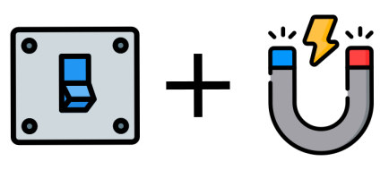
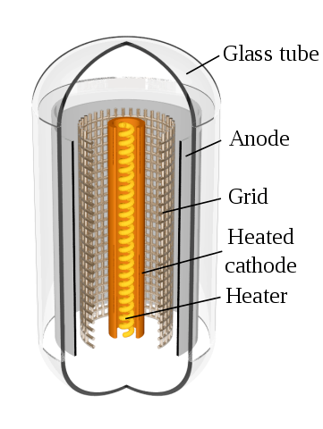
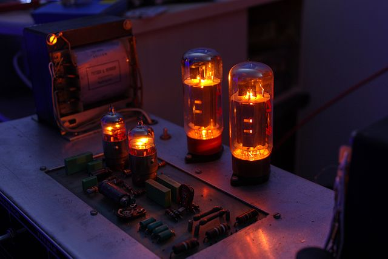
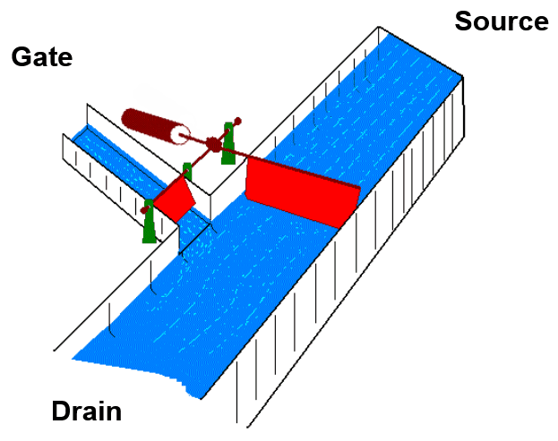
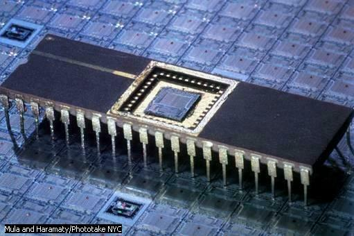

# 5 Generations of Computing Technology

We have looked at how information flows through the parts of a modern computer. It took centuries of innovation for computers to get to this point.

In this section we take a brief glimpse at a few important advancements in computing hardware.

 

Here we will focus on computing devices that used electricity.

> Fundamentally, all the devices listed below have one simple job:
> **To store one of two states: On or Off** 

 

By keeping track of this **On or Off state** we can:

- count,

- compare,

- add,

- subtract,

- any combination of the operations listed above.

 

## Gen 1: Electro-Mechanical Relays

An electro-mechanical relay (commonly called "a relay") is an electrical on/off switch that is controlled by magnetic force.

The magnetic force is generated by a coil (many loops of wire together).

This force pulls on a metal plate and the plate touches an electrical contact. While the plates are touching, electricity can flow, putting it in the **ON position**.

If the coil is not energized and there is no magnetic force, the metal plates don't touch and electricity cannot flow, putting the relay in the **OFF position**.

 

<a href="https://en.wikipedia.org/wiki/Relay"><em>Simple electromechanical relay</em></a>

 

<video width="100%" controls>
<source src="https://upload.wikimedia.org/wikipedia/commons/3/32/Relais-Finder-12A.webm" type="video/webm">Your browser does not support the video tag.
</video>

<a href="https://en.wikipedia.org/wiki/Relay"><em>Operation of a relay</em></a>

  

### Characteristics of Relays

- **Moving parts!**
  - causes wear and makes them prone to failure
  - makes them slow
- Bulky taking a lot of space
- Electrical contact could get clogged (blocked)

## Gen 2: Vacuum Tubes

Vacuum tubes replaced the relays as a purely electronic component.

They worked by heating an element similarly to a light bulb. The glowing hot element (the cathode) ejects electrons that can be captured by a metal plate (the anode).

Note that electrons are negatively charged, thus external positive charges will attract it and external negative charges will repel it.

Between the cathode and the anode there is a grid. If the grid has a positive charge, the electrons will get to the anode, making electricity flow and **creating the ON state**. If the grid has a negative charge the electrons will be repelled and electricity will not flow, **creating the OFF state**.

<a href="https://en.wikipedia.org/wiki/Vacuum_tube"><em>Vacuum tube structure</em></a>

 

<a href="https://www.youtube.com/watch?v=OwS9aTE2Go4"><em>Vacuum Tube Animation by Real Engineering</em></a>

 

<a href="https://en.wikipedia.org/wiki/Vacuum_tube"><em>Vacuum Tube amplifier working</em></a>

 

### Characteristics of Vacuum Tubes

- Big power consumption,
  - The heating element needs to be glowing hot!
  - Therefore generates lots of heat
- Expensive to manufacture,
- No moving parts.
- Components were protected from the elements (thanks to the glass bubble)

 

## Gen 3: The Transistor

Transistors are a form or electronic component that can control the flow of current similarly to a vacuum tube but much more compact and with a fraction of the power.

By adding some materials on a silicon surface (think of a glass surface) we can create 2 surfaces that conduct electricity (the **source** and the **drain**) and one surface in the middle (the **gate**) that only conducts electricity under certain conditions. This is know as a semi-conductor.

The gate will only become a conductor if there are small amounts of electricity touching it. Once the gate become an electrical conductor, current can flow from the source to the grain as if there was a direct connection between them. Thus, the gate works as a **ON / OFF switch**.

 

<a href="https://www.righto.com/2013/09/understanding-z-80-processor-one-gate.html"><em>Transistor Structure</em></a>

 

If we were to compare electricity to water, we could use the following analogy for a gate controlling a much larger flow:

 

<a href="https://de.wikipedia.org/wiki/Bipolartransistor#/media/Datei:Transistor_animation.gif"><em>Transistor analogy with water gates</em></a>

 

<a href="https://www.engineering.com/ElectronicsDesign/ElectronicsDesignArticles/ArticleID/16337/Vacuum-Tubes-The-World-Before-Transistors.aspx"><em>A replica of the first transistor created in 1947.</em></a>

 

### Characteristics of Transistors

- Compact size
- Cheap to manufacture
- Low power consumption

 

## Gen 4: Integrated Circuits (ICs)

Integrated circuits are a grouping of connected transistors on a single slice of silicon.

We can place millions of transistors inside a small **microchip**.

This generation of computing technology is **market by the reduction in size and the advancements in the manufacturing process**.

 

 

The video below helps us appreciate how tightly we can pack transistors inside a microchip:

 

<iframe width="560" height="315" src="https://www.youtube.com/embed/Fxv3JoS1uY8" frameborder="0" allow="accelerometer; autoplay; encrypted-media; gyroscope; picture-in-picture" allowfullscreen></iframe> 

 

## Gen 5: The Microprocessor

The Central Processing Unit (CPU) on a single microchip unit is a **microprocessor**.

The microprocessor uses a similar manufacturing technology to the microchip, however, the innovation comes from the way how different "modules" with different responsibilities are organized and combined on a single chip. In other words, **it's about the CPU architecture**.

 

The image below shows one example of micro-architecture for a CPU microprocessor.

Notice how the identified regions are responsible for unique functions. Together they form a system.

 

<a href="https://www.righto.com/2017/02/reverse-engineering-surprisingly.html"><em>Micro Architecture of the Intel 8008 CPU. Not all CPU components are identified.</em></a>

 

Intel Corp. introduced the first commercially produced microprocessor chip in 1971. The Intel 4004 had a 108 kHz clock and contained 2300 transistors.

<a href="https://en.wikipedia.org/wiki/Intel_4004"><em>Intel 4004 CPU, 1971</em></a>

 

As a comparison, the Intel Core i5 750 CPU, from the previous section has a 2.66 GHz clock, making it about 2.6 million times faster. It also contains [774 million transistors](https://ark.intel.com/content/www/us/en/ark/products/42915/intel-core-i5-750-processor-8m-cache-2-66-ghz.html).

 

## Diving Deeper (optional)

### Slides: History of Computer Devices

The slides below contain a brief history of the evolution of physical computers:

 

<iframe src="https://docs.google.com/presentation/d/e/2PACX-1vSawiWrVsUE7iSezXI4VqzrU5Dn8bki5luGQalGpnX35fssJ0peZTxLfDnSGmDfPzkYkQscZp8Ey4er/embed?start=false&loop=false&delayms=3000" frameborder="0" height="500" width="100%" allowfullscreen="true" mozallowfullscreen="true" webkitallowfullscreen="true"></iframe>

 

### How the CPU is made

The video below does a great job illustrating the manufacturing process of a modern CPU.

Global Foundries is the main partner for AMD's Zen family of CPUs, which includes the Ryzen CPU.

<iframe width="560" height="315" src="https://www.youtube.com/embed/qm67wbB5GmI" frameborder="0" allow="accelerometer; autoplay; encrypted-media; gyroscope; picture-in-picture" allowfullscreen></iframe>

