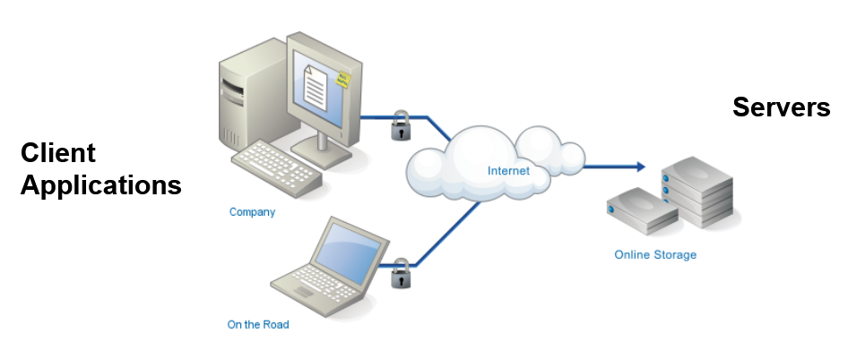
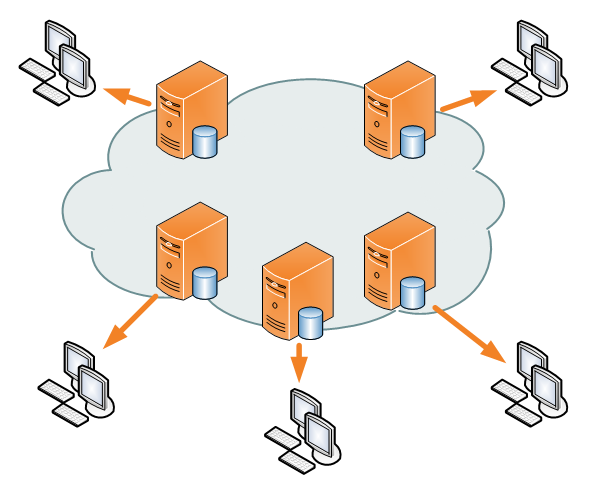
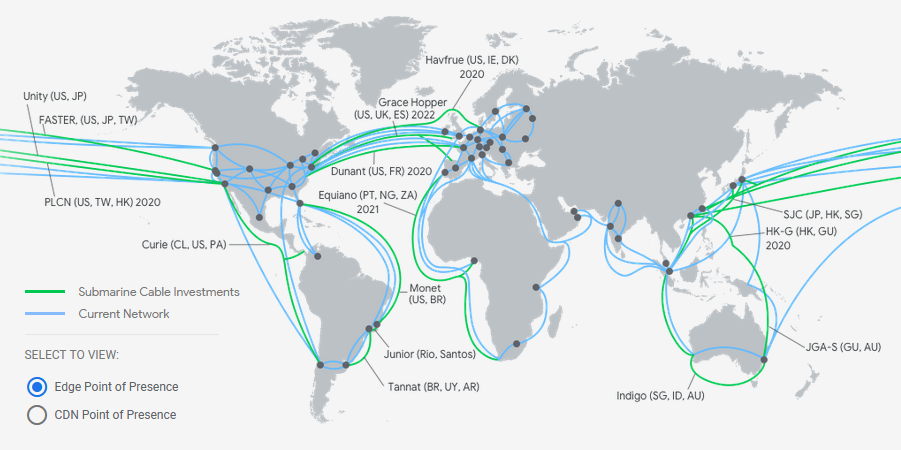
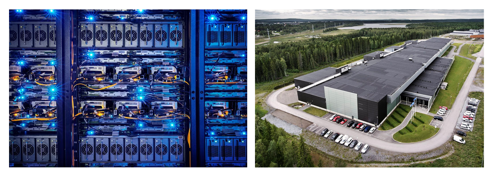

# Cloud Computing

> In simple terms, "The Cloud" refers to a network of computers connected to the internet.

<a href="https://medium.com/@storjproject/there-is-no-cloud-it-s-just-someone-else-s-computer-6ecc37cdcfe5"><em>Storj Labs on Medium</em></a>

 

The cloud is comprised of a client application and two or more servers which communicate and exchange data.

Most individual consumers use cloud services for data storage such as Google Drive or DropBox.

However, small to large businesses also use cloud computing to host their platforms. For example, Netflix and Twitter do not owe all of their own servers, instead, they buy cloud computing services from Amazon Web Services (AWS).

 

 

The two most important characteristics of Cloud Computing are high availability and on-demand services.

 

## High Availability

The cloud service is expected to be "always" available from "anywhere".

In practice, **"always" available and from "anywhere" is impossible to achieve**, however, there are techniques  that allow companies to get really close.

 

For example, cloud service providers usually have more than one server responsible for the same task. This means that if one of the servers have a technical problem, the service will be quickly diverted to another server to limit interruption.

 

<a href="https://en.wikipedia.org/wiki/Content_delivery_network#Technology"><em>Multiple servers providing the same service creates redunduncy</em></a>

> Servers can be strategically placed in multiple locations according to client demand, access to fiber-optic lines, and political-economic incentives.

 

Below you can see the distribution of server locations (infrastructure) for Amazon Web Services (AWS) and Google.

 

<a href="https://aws.amazon.com/cloudfront/features/?p=ugi&l=na"><em>Amazon Web Services Infrastructure</em></a>

 

<a href="https://cloud.google.com/about/locations/#network"><em>Google Cloud Locations</em></a>

 

## On-demand Services

One of the biggest values offered by cloud computing is the ability to increase and decrease computing power or storage "on the fly. Clients do not need to worry about the purchase and setup of new hardware and are able to change their service within a few seconds.

Most large cloud service providers offer plans that charge by the megabyte stored or per minute used. This means you only pay for what you consume.

The ability to scale up or down depending on demand is also referred to as rapid elasticity.

 

## Data centers & Resource Pooling

In order to offer competitive cloud computing services, providers build large data centers (also known as server farms) with hundreds or thousands of physical computers.

Each physical computer is typically "divided" into multiple virtual computers or containers. The concentration of resources under a single location enables resource pooling and the distribution of costs over many customers.

Because of the concentration of machines and the cooling required to keep computers running, data centers consume enormous amounts of electricity.

 

<a href="https://www.facebook.com/zuck/posts/10103136694875121"><em>Facebook’s Luleå data center in Sweden</em></a>

 

The vast majority of computers in data centers run Linux as it's operating system, [including Microsoft's Azure](https://www.zdnet.com/article/microsoft-developer-reveals-linux-is-now-more-used-on-azure-than-windows-server/) cloud computing service. This partially due to Linux being free and open source and partially due to it's stability and reliability.

 

## Client Software

The computers in the data centers will usually exchange information with an application running on the client's machine.

This application can take many shapes, for example, it can be:

- a web browser
- a mobile app
- a desktop app

 

A common example of client-side cloud software are Google Drive, Dropbox and OneDrive.

 

<a href="https://dazeinfo.com/2016/04/04/cloud-storage-google-drive-microsoft-onedrive-dropbox/"><em>Three examples of cloud storage services with client-side applications</em></a>

 

These three services offer an installable application that will silently sync files between computers and data centers.

Each application will include the details of how it connects to their data centers including authentication, security, communication protocols, etc.

 

## Requirement Considerations

When deciding which cloud service provider to use for personal or business needs, consider your requirements on the following categories:

#### Data Control

How much control over the data would you like to have?

Is the service provider transparent about how your data might be used by others?

Do you need control over the geographical location of where your data is stored?

#### Reliability

How much up-time can the service provider guarantee? 

What happens if the data is not available when you need it?

Does the service includes auto-backups?

#### Data Security and Management

Can you trust the service to protect your data against unauthorized access?

What kind of attacker are you trying to protect against? (also know as [Threat Model](https://en.wikipedia.org/wiki/Threat_model) )

When is the data protected and when is it not?

Under which circumstances would your data be given to someone else?

#### Regulation Compliance

Is the service compliant with any necessary regulations (ex. if providing a service to a governmental organization) ?

Does the service complies with local privacy regulations?

​	Ex.: [General Data Protection Regulation (GDPR)](https://www.zdnet.com/article/gdpr-an-executive-guide-to-what-you-need-to-know/) or [California Consumer Privacy Act (CCPA)](https://www.oag.ca.gov/privacy/ccpa)

 

## Self-Hosting

It is also possible to host your own cloud services using open source software.

To implement a self-hosted cloud service you will need:

- A server with a public IP
- Storage space in your server
- The software that will provide the desired service
- The expertise and the time to install and maintain your system.
- A domain name (optional)

 

Similarly to the selecting a cloud service provider, it is important to consider the requirements for a self-hosted solution:

- Do you have the time and resources to self-host?
- What are the consequences if things go wrong?
- How will I test the service to make sure I'm doing this right?

 

### Setting up a server

The fist step to self-host is to setup a sever with a public IP.

A server is simply a machine setup with an operating system and software that listens to request for a specific service.

There are two ways of getting a server going:

1. **Setup an "in house" server:** Buy the physical machine, install the operating system and request a public IP from your ISP (internet service provider).
2. **Rent a server**: Pay to have access to a server that is ready to go. Different formats available:
   1. Virtual Private Server (VPS): a single physical machine is divided into multiple "virtual computers" and your rent one of those virtual computers. This is typically the cheapest option.
   2. Dedicated Server: you are given access to a dedicated physical machine. Typically used for applications that are cpu and ram intensive.

 

<em>Examples of companies that rent servers</em>

 

### Installing your application

Install and configure the application to run on the server. 

Whether you developed the application or you are using a ready-made solution it needs to be installed on the server.

There are many choices of open source software available. Open source means that they are free to use and most importantly, their source code is available for anyone too see, including bugs. This typically means that bugs fixes and improvements get added faster.

Depending on the software and the server, there might be many layers that need to be configured to work properly (eg. database, firewall, software dependencies, etc ).

### Self-hosting examples

Nextcloud is an open source, "office-in-the-cloud" alternative to Google Drive or Office 365. It is 

Governments in [Germany, France and Sweden](https://www.zdnet.com/article/eu-turns-from-american-public-clouds-to-nextcloud-private-clouds/) have chosen to replace American cloud services with Nextcloud.

Let's setup our own Nextcloud instance as a demo.
The demo uses the following tutorial:

[How To Install and Configure Nextcloud on Ubuntu 20.04](https://www.digitalocean.com/community/tutorials/how-to-install-and-configure-nextcloud-on-ubuntu-20-04)
