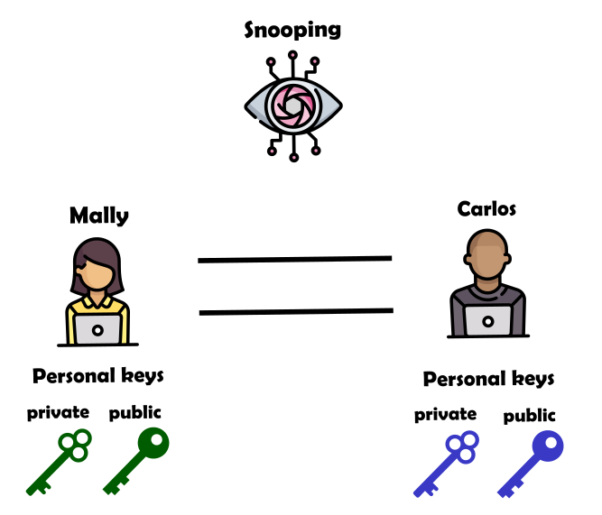
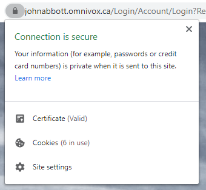
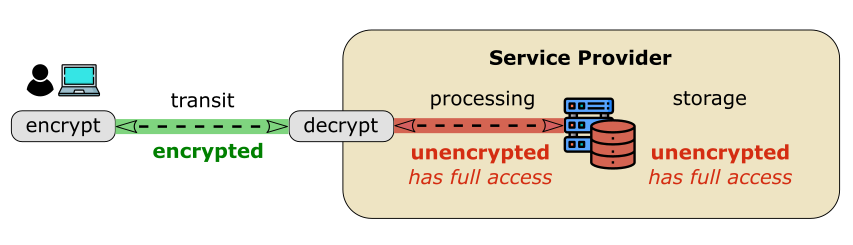
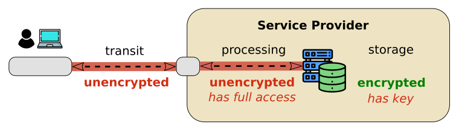
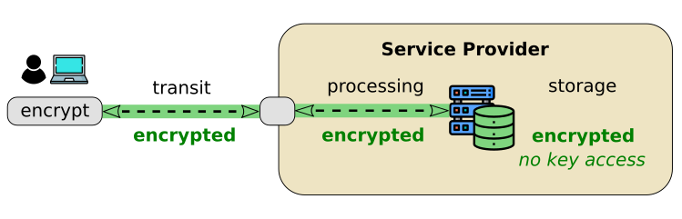
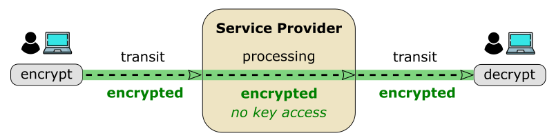
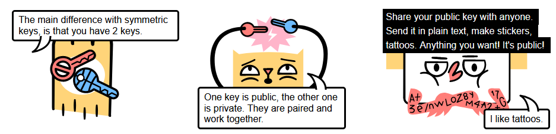

# Intro to Data Protection

This chapter does a very brief introduction to encryption and data protection on the web.

You will take a deeper look at this topic during the Information Technology course (420-2T3) next semester and the Security course (420-5N4) in your 5th semester.

## Encryption

> To encrypt information means that the original "readable" information has been scrambled in a way that it cannot be understood.
>
> This can be done to any type of file: text, audio, video, programs, etc.

The initial step of "scrambling" information is known as **encoding**.

The process of arranging the information back to normal is known as **decoding**.

This is very similar to how we encode and decode characters to ASCII binary. In one side we have readable text and in the other side we have binary numbers that don't mean anything to humans but that can be later decoded back into readable text.

There are two types of encryption: symmetric and asymmetric

 

### Symmetric Encryption

In symmetric encryption the both the person sending and the person receiving the message have access to the secret key. Thus the term symmetry.

An example of an early type of symmetric encryption is **Cesar's cypher**.

Cesar's cypher shifts each letter in a word forward by a certain number positions. This transforms the message in something unrecognizable. To revert to the original word, you just shift each letter back by that know number of positions.

 

<iframe height="700" style="width: 100%;" scrolling="no" title="Nanny State - Caesar Cipher" src="https://codepen.io/maujac/embed/ZEJKQWw?default-tab=html%2Cresult&theme-id=dark" frameborder="no" loading="lazy" allowtransparency="true" allowfullscreen="true">
  See the Pen <a href="https://codepen.io/maujac/pen/ZEJKQWw">
  Nanny State - Caesar Cipher</a> by Mauricio Buschinelli (<a href="https://codepen.io/maujac">@maujac</a>)
  on <a href="https://codepen.io">CodePen</a>.
</iframe>

 

You can experiment with Cesar's cypher using [cryptii.com](https://cryptii.com/pipes/caesar-cipher). To visualize the cypher check [xarg.org](https://www.xarg.org/tools/caesar-cipher/).

Cesar's cypher is an example of symmetric encryption because both the person encrypting and the person decrypting the message know exactly how many positions to shift each letter (the key).

 

Another example of symmetric encryption would be to use the **7z compression tool** to compress a file with a password. Anyone uncompressing the file would need to know the correct password.

 

> Symmetric encryption has a major limitation for internet users:
>
> How can two parties securely agree on the symmetric key if they have never met?

 

### Asymmetric Encryption

Asymmetric encryption enables two parties who have never met to securely exchange data.

Each party needs to create a pair of keys consisting of **one public and one private key**.

> The public key can be copied and distributed widely.
>
> The private key should be safely stored and never shared.

The private and public key have a special mathematical relationship:

1. Messages encrypted with the public key can only be decrypted with the private key.

2. Messages can be signed by a private key and verified with the public key (not covered here).

 

Consider the following scenario:

Mally and Carlos want to communicate securely and each one has created a private and a public key.

There is also an eavesdropper on their communication line that can get a copy of whatever is exchanged.

 

 

 

Mally sends Carlos a copy of her public key and Carlos does the same. Technically, anyone listening to their communication will also have a copy of their keys.

If Mally wants to send Carlos a secure message she can encrypt her message with Carlos' public key.

> Remember, a message encrypted with **a public key** can only be decrypted with it's **respective private key**.

This means that even if the eavesdropper has a copy of the public keys and the encrypted message, it cannot decrypt the message without Carlos' private key, which was never shared.

Carlos in the other hand has the private key to unencrypt the message.

 

 

> Note that because of the of math calculations required to unencrypt a message, **asymmetric encryption is relatively slow compared to symmetric encryption**.
>
> When speed is important, symmetric keys are preferred whenever it is safe to use it.

We can apply the same encryption principles to any kind of data being exchanged or stored via the internet.

 

*The following section is based on the article [How Does HTTPS Work?](https://tiptopsecurity.com/how-does-https-work-rsa-encryption-explained/) by TipTopSecurity.com*

## HTTPS

The most widely used form of asymmetric encryption today is HTTPS.

HTTP  is the communication protocol used by browsers and web servers to exchange information via requests and responses.

> The problem with HTTP is that **all data is exchanged in plain text**, which means anyone listening to the traffic can read the data.

This is particularly problematic if you are exchanging sensitive information such as passwords bank account information.

> HTTPS solves this problem by encryption all the data contained in the HTTP requests and responses.
>
> The only information that remains visible are the domain names and IP addresses

<a href="https://tiptopsecurity.com/how-does-https-work-rsa-encryption-explained/"><em>Traffic over HTTP vs HTTPS</em></a>

 

Your browser is using HTTPS (HTTP + TLS) when you see a small lock to the left of your URL.

Never enter passwords in websites that do not support HTTPS 🏴‍☠️

 

 

**What HTTPS is not**

Note that the IP address and the domain names remain visible when using HTTPS.  Otherwise it would be impossible to route the packets. This means that the identity of the client and the website are visible.

 

If you would like to know the details of how HTTPS works see the Looking Further section at the end of the page.

 

The diagrams in the next section were inspired by the article Forget Apple vs FBI, Slack & Gmail already have Backdoors by Brendan Diaz and the svg icons were made by Freepik in flaticon.com

## Data Protection

If we look at data in general (rather than HTTP traffic), we can break down data encryption into the following categories:

- **Encryption in transit**
- **Encryption at rest** (server-side-encryption)
- **Client-side encryption** (“zero-knowledge” encryption)

- **End-to-end encryption** (for two clients communicating)

 

### Encryption in Transit

In transit encryption means that the data is protected while moving from the client to the service provider (eg. Google or Microsoft).

There is no guarantee that:

- the data is encrypted once it reaches the service provider;

- the data is encrypted in the client's computer.

   

 

> HTTPS is one protocol that ensures in-transit encryption.

 

### Encryption at Rest

In encryption at rest, also known as server-side encryption, the **data is protected while being stored** (at rest).

There is no guarantee that:

- the data is encrypted in transit;
- the service provider does not have access to the key.

 

 

One major advantage of encryption at rest is that if an attacker gains access to the stored information **but not the key**, they cannot decrypt it.

 

### Client-side Encryption

In client-side encryption, also known as "zero-knowledge" encryption, **the data is encrypted at local client before being sent.**

> The encryption keys are managed by client only. The service provider never sees them.

This means that even though the service provider is storing the data, it has **no way of accessing it**.

 

 

### End-to-end Encryption

End-to-end encryption is a case of client-side encryption that happens when two clients are communicating (rather than storing the data).

In this case data is encrypted from one client to another (end-to-end).

> A service provider (such as WhatsApp or Signal) manages the data exchange and the key exchange between the clients but never sees the keys.

This is possible thanks to the Diffie-Hellman key exchange. See Diving Deeper for details.

  

 

## VPNs

Note that none of the encryption methods mentioned above hide the identity or the location of the client and website.

If you would like to hide your identity or completely encrypt all traffic content between two points, the best option is to use a VPN service (virtual private network).

 

#### How VPNs work

1. A connection is stablished between a client and a server.
2. The computers agree on a **new encrypted communication protocol**.
3. From now on, **every single packet** of information exchanged will be encrypted by this new protocol.
4. The encrypted packet (which at this point doesn't look anything like a regular routable packet) is **placed inside a normal internet packet** with a sender and receiver IP.

   1. You can think of this process as a **"wrapper" or "tunnel"**. Anyone intercepting and analyzing the new packets is unable to understand their contents.
5. Both computers continue to route their traffic using this secure tunnel. All data is seen as "coming from" or "going to" these two computers (end points).

 

> Remember that all data must ultimately travel over the internet in the form of packets.

Since packets need a sender and receiver IP, anyone observing the traffic can tell that two computers are communicating. However, no one can see the content of their communication.

 

<a href="https://www.techhive.com/article/3158192/howand-whyyou-should-use-a-vpn-any-time-you-hop-on-the-internet.html"><em>VPN connection tunnel</em></a>

 

Someone snooping the traffic can only see the following:

- You are communicating with the VPN endpoint but what happens to the connection after that is unknown.
- The endpoint is communicating with a website. Whether that connection is forwarded to someone else or not is unknown.

 

## Recommended Videos

<iframe width="560" height="315" src="https://www.youtube.com/embed/ZghMPWGXexs" frameborder="0" allow="accelerometer; autoplay; clipboard-write; encrypted-media; gyroscope; picture-in-picture" allowfullscreen></iframe>

 

## Diving Deeper (optional)

### HTTPS

#### Having fun with HTTPS 

The website [howhttps.works](https://howhttps.works/) explains how HTTPS works through a comix series that is a lot of fun.

 

#### Handshake Details

Steps of how HTTPS works in more detail:

1. Your browser reaches out to the website server, requests a connection and specifies the cryptographic algorithms it can support (the different encryption flavors).
2. The server confirms which crypto algorithms will be used, sends you its public key, it's certificate and some information to be used during your session. It keeps its private key a secret.
3. Your browser takes the website's digital certificate and goes to a certificate authority to verify it. The browser wants to make sure the website is who they say they are.
4. Once the certificate it verified, your browser generates a third key called a *shared secret key or session key*. The session key is encrypted by your computer using the public key you got from the server and sends it over to the website. The server decrypts the session key that it received from you using  the secret private key. To Now both ends have the session key that your  computer generated.
5. To confirm that the website has the correct session key it sends a finish message encrypted with the session key.
6. The browser also confirms that two both have the correct key by sending a finish message encrypted with the session key.
7. Now the browser is in a session with the server using only symmetric encryption for the duration of the session. The browser sends an HTTP**S** request.
8. The server replies with a HTTP**S** response.

 

<a href="https://medium.com/@hiroki_ark/how-https-works-7111e4828884"><em>How HTTPS Works? by hiroki_ark on Medium</em></a>

 

**Recommended Read on HTTPS**

If you still would like to know more, the article [How Does HTTPS Work? RSA Encryption Explained](https://tiptopsecurity.com/how-does-https-work-rsa-encryption-explained/) by TipTopSecurity.com is an excellent resource.

 

### Give me tha Math! 🍴🧮

If you would like to understand the math behind asymmetric encryption watch the following videos by Khan Academy:

- [The discrete logarithm problem](https://www.khanacademy.org/computing/computer-science/cryptography/modern-crypt/v/discrete-logarithm-problem)
- [Diffie-Hellman key exchange](https://www.khanacademy.org/computing/computer-science/cryptography/modern-crypt/v/diffie-hellman-key-exchange-part-2)

 

### Relevant xkcd

<a href="https://xkcd.com/2365/"><em>Why unencrypted messaging is still a thing.</em></a>
