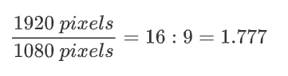

# Digital Images

In week 2 we discussed how digital images are a collection of individual colored pixels.

<br>


<p align="center"><a href="#"><em>Individual pixels of a color image</em></a></p>

<br>

> We can form any color by combining three fundamental colors: **R**ed, **G**reen, and **B**lue.
>
> The intensity of each RGB color is provided in a range from 0 to 255.


<br>


<p align="center"><a href="https://knowthecode.io/labs/basics-of-digitizing-data/episode-14"><em>An image is formed of logical pixels with a position and 3 color "intensities"</em></a></p>

<br>

> The pixels that store the image information are **logical pixels**. They exist in a file or in memory.
>
> When we display the image on the screen, each logical pixel gets mapped to a **physical pixel**, which is literally a tiny light source in the screen.

<br>


<p align="center"><a href="https://prometheus.med.utah.edu/~bwjones/2012/04/retina-display-revisited-for-the-ipad/"><em>iPhone 4 retina display</em></a></p>

<br>

After mapping each logical pixel (image, software) to a physical pixel (light, hardware), we display a complete image.

<br>


<p align="center"><a href="https://en.wikipedia.org/wiki/Retina_display"><em>Visible pixels of the iPhone 3</em></a></p>

<br>

## Image Size

The size of digital images are specified in pixels using the format **Width x Height**.

In other words, how many tiny little "color squares" the image contains horizontally vs vertically.

<br>

For example, the image below is 640 x 480 pixels.


<p align="center">
	<a href="https://en.wikipedia.org/wiki/Retina_display"><em>Passion fruit flower of size 640x480 logical pixels.</em></a>
</p>

<br>

To inspect the size of an image you have two options:


1. Download the image and inspect the file properties.
2. If using Firefox, right-click and select "View"

<br>

## Resolution

When dealing with digital images,  **the term resolution can carry two different meanings:**

1. The number of pixels of an image or screen.
2. How many pixels fir in one inch.

<br>

### Resolution as pixels size

To talk about resolution as the number of pixels an image contains is effectively the same as describing it's size.

> The more pixels an image contains, the more detail it can store in the form of subtle differences in shades from one pixel to another.

<br>


<p align="center"><a href="https://upload.wikimedia.org/wikipedia/commons/f/f2/Resolution_illustration.png"><em>Increasingly pixel count in a image.</em></a></p>

<br>

It is also common to see the pixel count resolution given as the total number of pixels in an image.

For example, an image of 6,000 × 4,000 pixels has in total 24,000,000 pixels, or 24 MP (megapixels).

Camera sensors are commonly rated in megapixels because that is how many distinct pixels they capture in one photo.

<br>

#### Screen resolutions

Screen resolutions are typically measured as the vertical or horizontal pixels dimensions of a monitor.

<br>


<p align="center"><a href="https://www.bestusbpoweredmonitor.com/720p-vs-1080p-vs-1440p-vs-4k-vs-8k/"><em>Screen resolution as a measure of pixel count.</em></a></p>

<br>

### Resolution as pixel density

Resolution as pixel density is technically more correct than using it as pixel count.

> Pixel density describes how many pixels fit in an inch or PPI (pixels per inch).

<br>


<p align="center"><a href="https://levvvel.com/pixel-density-resolution/"><em>Increasing pixel density.</em></a></p>

<br>

PPIs are commonly mistaken by DPI (dots per inch), however, DPI's are normally only applicable when dealing with printers.

<br>

**Apple's retina displays** are one example of screens that have a higher pixel density than traditional screens.

<br>


<p align="center"><a href="https://www.internetingishard.com/html-and-css/responsive-images/"><em>Standart vs Retina Resolution by Interneting is Hard</em></a></p>

<br>

## Aspect Ratio

The aspect ratio of an image or a screen is equal to it's width divided by it's height.

For example, for an image with dimensions 1920 x 1080 pixels, the aspect ration is:

<br>



<br>

>  An image can be cropped to a have a specific aspect ratio.
>
> However, if the image is stretched or shrunk without respecting it's aspect ratio, the image will be deformed.

<br>

In the image below the landscape image is being cropped to multiple images of different aspect ratios (follow the colored lines).

<br>


<p align="center"><a href="https://photographylife.com/aspect-ratio"><em>Image being cropped to different aspect ratios.</em></a></p>

   <br>

An image can be resized while respecting the aspect ratio by changing the width and the height by the same amount.

If the width and the height are changed by different amounts, the image is distorted. 


<br>

## Raster vs Vector Image Types

So far we've focused on storing image information as a pixel grid. However, there is a second way of storing image information.

<br>

> Images described by a collection of pixels are called **raster images**.
>
> Images described by geometric formulas and shapes are called **vector images**

<br>


<p align="center"><a href="https://www.seekacreative.co.nz/resources/vector-vs-raster-files"><em>Vector vs Raster Files</em></a></p>

<br>

### Raster images

**Raster images** are defined using a grid of pixels (as seen before).

<br>


<p align="center"><a href="https://academickids.com/encyclopedia/index.php/Raster_graphics"><em>Raster graphics</em></a></p>

<br>

There are many types of raster image file types, each one has it's pros and cons.

Some common formats for the web are `.jpeg`, `.png`, `.gif` and `.webp`. 

<br>

#### JPEG

[Jpeg](https://en.wikipedia.org/wiki/JPEG) (joint photographic experts group) also known as `.jpg`. Is widely used in digital cameras and the web.

- Lossy compression.
- 24-bit color (up to 16million colors).
- No transparency.
- No animation.
- Typically smaller in size.


#### PNG

[Png](https://en.wikipedia.org/wiki/Portable_Network_Graphics) (portable network graphics). Typically used for the web.

- Lossless compression.
- 8-bit (256 colors) or 24-bit colors.
- Allows transparency.
- No animation.
- Typically larger in size than jpeg.


#### GIF

[Gif](https://en.wikipedia.org/wiki/GIF) (graphics interchange format). Old format but still popular on the web due to animations.

- Lossless compression.
- Only 256 colors
- Allows transparency.
- Allows animation.
- Typically smaller in size than jpeg.


#### WebP

[WebP](https://en.wikipedia.org/wiki/WebP) is Google's new image format introduced in 2010 so it is not widely adopted yet.

- Lossless and lossy compression.
- 24-bit color.
- Allows transparency.
- Allows animation.
- Typically smaller in size than png.

<br>

### Vector Images

**Vector images** are defined using algorithms. The shapes and paths that compose a vector image are described by math and therefore can create perfect lines at any zoom level.

<br>

One of the images below is a raster image and the other is a vector image.


<p align="center"><a href="https://www.flaticon.com/authors/eucalyp" title="Eucalyp"><em>Eucalyp</a> from <a href="https://www.flaticon.com/" title="Flaticon"> www.flaticon.com</em></a></p>

<br>

The vector image above has 3.7 kB in size while the raster equivalent has 9.5 kB. This is a 2.5x size difference.

<br>

> In addition to creating images with perfect definition, vector images are generally much smaller in size than raster formats.

<br>

#### SVGs

[Scalable Vector Graphics (SVG)](https://developer.mozilla.org/en-US/docs/Web/SVG) is the most commonly used example of vector images.

<br>

These are the contents of a simple svg image:

<br>

```html
<svg width="300" height="200" version="1.1" baseProfile="full" >
      <rect width="100%" height="100%" fill="black" />
      <circle cx="150" cy="100" r="90" fill="blue" />
</svg>
```

<div style="text-align: center;" class="wrapper">
  	<svg version="1.1" baseProfile="full" width="300" height="200">
          <rect width="100%" height="100%" fill="black" />
          <circle cx="150" cy="100" r="90" fill="blue" />
	</svg>
</div>
<br>

In the svg above, `cx` and `cy` are the coordinates of the center of the circle. `r` is the radius.

<br>

Below are two websites with a database of SVG's that are free to use (attribution required):

- [Flaticon.com](https://www.flaticon.com/)
- [freesvg.org](https://freesvg.org/)

<br>

SVGs are commonly found in websites such as the navigation bar of Pexels Video website:

<br>


<br>

This nav bar uses three different SVG's: the Pexels logo (left) and two icons (search and hamburger menu on the right).

<br>

#### Limitations of vector images

Because all shapes in vector images must be described mathematically, they cannot be used to capture real-life pictures.

<br>

SVG images are best used for:

- Logos
- Charts
- Drawings and Illustrations
- Icons

<br>

> A photograph cannot be exported to svg. It must be "constructed" into an svg approximation.

Conversion programs exist but can only take you so far.

<br>


<br>

<iframe width="560" height="315" src="https://www.youtube.com/embed/s-kPg4vYKfk" frameborder="0" allow="accelerometer; autoplay; clipboard-write; encrypted-media; gyroscope; picture-in-picture" allowfullscreen></iframe>

<br>

## Summary table

Below is a summary table for the image file formats covered in this chapter:

<br>

|                          **Format**                          | **Type** | **Transparency** | **Animation** |
| :----------------------------------------------------------: | :------: | :--------------: | :-----------: |
| [GIF](http://en.wikipedia.org/wiki/Graphics_Interchange_Format) |  Raster  |       Yes        |      Yes      |
| [PNG](http://en.wikipedia.org/wiki/Portable_Network_Graphics) |  Raster  |       Yes        |      No       |
|          [JPEG](http://en.wikipedia.org/wiki/JPEG)           |  Raster  |        No        |      No       |
|          [WebP](http://en.wikipedia.org/wiki/WebP)           |  Raster  |       Yes        |      Yes      |
|   [SVG](https://developer.mozilla.org/en-US/docs/Web/SVG)    |  Vector  |       Yes        |      Yes      |

<br>

## Diving Deeper (optional)

For a more **detailed description of popular image file formats** see the article below:

[Understanding the Most Popular Image File Types and Formats](https://1stwebdesigner.com/image-file-types/) by 1stwebdesigner.com

<br>

For a closer comparison of SVG vs. PNG vs JPEG:

[SVG vs. PNG vs JPEG](https://genkihagata.com/blog/svg-vs-flat-images.html), genkihagata.com

