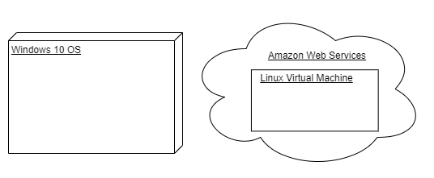
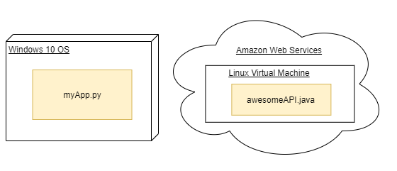
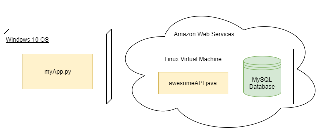
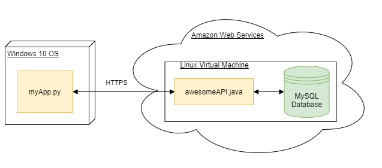

# System Architecture Diagrams

In this chapter we will look at two types of architecture diagrams used in software engineering:

- **General System Architecture diagrams** (no specific rules for describing elements)
- **UML Deployment diagrams** (has a spefic structure for how elements are illustrated)

 

System Architecture Diagrams illustrate the how the different components of a system work together.

## General System Architecture Diagrams

> System Architecture diagrams can be "high-level" or very detailed. It depend's on **the audience.**

This is a generic type of diagram and the level of detail will depend on the audience, **there is no technical specification for how it should be done.**

 

The goal is to identify and label the main software components as well as their connections.

 

Below is the architecture diagram for an Android app prototype. The diagram is made for an "entry-level" technical audience and only features the main system components.

The following is illustrated:

- Major system components,
- How components connect,
- No details regarding types of servers or versions of Android.

 

<a href="https://www.epimorphics.com/student-project-myrivers-intro/"><em>Architecture diagram for an app prototype made by 2nd year SC students.</em></a>

 

The next two diagrams illustrate how a Minicraft server project runs on Google Cloud Platform.

> Both diagrams illustrate the same system, however, they are intended to different audiences.

Notice how the first diagram has less components and more generic names

 

<a href="https://cloud.google.com/blog/products/gcp/brick-by-brick-learn-gcp-by-setting-up-a-minecraft-server"><em>Diagram of a Minecraft server for younger audiences. All major components included.</em></a>

 

Even though the diagram is simplistic it manages to describe:

- Where the system is run,
- How the clients (users and micraft application) will interact with the project,
- All major components of the system.

 

Below is the same system architecture but intended for a technical audience.

 

<a href="https://cloud.google.com/blog/products/gcp/brick-by-brick-learn-gcp-by-setting-up-a-minecraft-server"><em>Architecture of Minecraft server project hosted on Google Cloud Platform (for technical audiences).</em></a>

 

As previously mentioned, general system architecture diagrams can vary drastically in detail and scope.

There is no "correct" way of doing it as long as you transmit the intended information to your audience.

 

## Deployment Diagrams

A deployment diagram is a type of UML diagram that illustrates how the software system will be deployed on the hardware.

In other words, **it shows what does it takes to run your software system.**

> Unline a generic system architecture diagram, a deployment diagram has a structure that should be followed.

 

Technical UML deployment diagrams uses several symbols to differentiate parts.

In this course we will include the following symbols:

- Nodes
- Code instances (artifact instances)
- Databases
- Connections

 

### Nodes

A node represents a device or the execution environment of your application.

**Nodes should identify the type of device or opperating system running the software.**

> Nodes are typically represented with a cube, however in this course you can use other symbols as long as the execution environment is clearly identified.

Nested execution environments should also be illustrated. For example, if a virtual machine is deployed in a cloud service instead of a physical machine.

 

<em>Two ways of representing Nodes. Note the nesting on the right node.</em>

 

### Code instances

Code instances (called artifacts in UML) represent the literal code that is running inside an execution environment.

**The code instance is illustraded by a rectangle with the file name.**

 

 

### Databases

Databases are responsible for storing user or application data. They represent a storage device as well as the software necessary to manage the storage device.

> Databases can be represented by a cylinder or rectangle.

A database needs an execution environment which needs to be identified.

 

 

### Connections

The connections illustrate how the components of the system communicate.

**Connect the specific components that exchange information.**

When creating a connection:

- If the type of connection or communication protocol is specified it should be included.
- If known, indicate the direction of information exchange (eg.: one way or two way).

 

 

## Exercise

Create a **deployment diagram** for an Android Application prototype.

**Audience:** potential investors with basic networking knowledge

 

Your application *MyApp.apk* runs inside a device with Android 8 (or higher).

The app uses HTTPS to communicate to the *Application Server*, which is run inside a Linux virtual machine (named Linux 1) deployed on Amazon Web Services (AWS).

*Application Server* communicates to the main MySQL database over SSL. This database is running on a second Linux VM (virtual machine) deployed on AWS.

There is a backup MySQL database also running on a Linux VM, which is deployed on Digital Ocean and it syncs to the main database over HTTPS.

 

    
Solution

    <ul>
        <li>
            
        </li>
    </ul>

