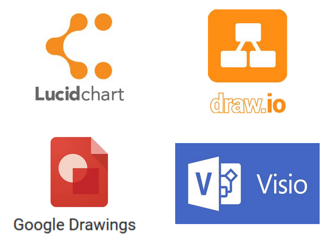
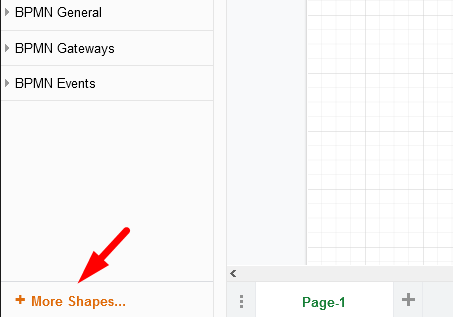
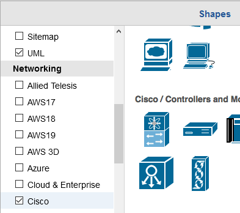
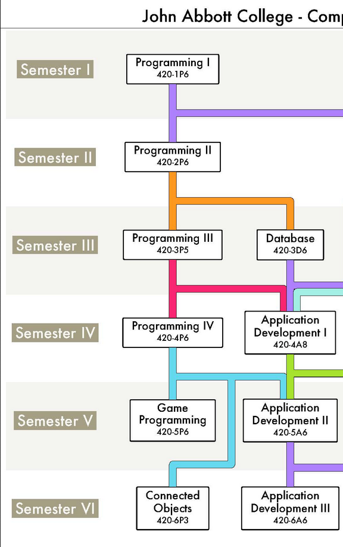

# Diagrams

Learning to create good diagrams is very important in any technical industry. 

> Diagrams helps us express ideas quickly and effectively with minimal written language.

 

For example, when looking at the operating system we used the following diagram:

 

 

Explaining the relationship between all the elements in the diagram would likely take a lot longer without a visual representation.

 

Below is another example. Compare the text explanation with the accompanying diagram:

Text:

​	*Kanban boards visually depict work at various stages of a process using cards to represent work items and columns to represent each stage of the process. Cards are moved from left to right to show progress and to help coordinate teams performing the work. A Kanban board may be divided into horizontal "swimlanes" representing different kinds of work or different teams performing the work. A Backlog pools all tasks which are then selected by priority and assigned to a developer. Once the task is done and tested, the next team responsible for deployment receives it and put it into production.*

Diagram:

<a href="https://www.cuelogic.com/blog/scrum-vs-kanban-a-developers-on-the-project-comparison"><em>Scrum vs Kanban: A Developer’s ‘On the Project’ Comparison</em></a>

 

## Diagramming Tools

There is a plethora of diagramming tools available. For the most part they work similarly.

 

Here is a a few recommendations for general diagramming tools:

 

>  In this course we will focus on **Draw.io** (recently renamed diagrams.net ) because:
>
> - Open source & free,
> - No sign-up required,
> - Web based and dedicated app options (no need of internet),
> - Integrates with Google Drive and OneDrive,
> - Real-time collaboration,
> - Includes many libraries of ready-made images.

#### [Access Draw.io via this link](https://app.diagrams.net/)

 

### Draw.io Setup

1. Choose where to save your diagram.
2. Create new  OR open existing diagram.
3. Choose a template to start with.
   1. Each template comes pre-loaded with relevant image libraries.
   2. Image libraries can be added or removed later.
   3. Start with *Basic Blank Diagram* for now.
4. Rename your file.

 

Like any new tool, Draw.io can feel a little awkward at first.

The following two "Getting Started" videos covers the basics (6 mins total):

 

<iframe width="560" height="315" src="https://www.youtube.com/embed/PfY5BN-Saho" frameborder="0" allow="accelerometer; autoplay; clipboard-write; encrypted-media; gyroscope; picture-in-picture" allowfullscreen></iframe>

 

<iframe width="560" height="315" src="https://www.youtube.com/embed/_-2OrMqJW3A" frameborder="0" allow="accelerometer; autoplay; clipboard-write; encrypted-media; gyroscope; picture-in-picture" allowfullscreen></iframe>

 

> Learning how to use the **keyboard shortcuts will save you a lot of time**.
>
> Check the keyboard shortcuts at:
>
> *Help Menu* (top bar) > *Keyboard shortcuts*

 

### Enabling new image libraries

Use the "More Shapes" option in the bottom left of the window to **enable additional image libraries**.

 

 

You can add more than one library at the same time by checking multiple boxes.

In the example below, the *UML* and the *Cisco* libraries have been enabled.

 

 

## Diagramming Practice

### Exercise 1

Re-create the first two columns of JAC's Computer Science program map (access the [original diagram here](https://www.johnabbott.qc.ca/academics/career-programs/computer-science-technology/))

 

 

### Exercise 2

Re-create the following network topology using one or more Networking libraries:

 

 

> **Please note the following before you begin:**
>
> - The icons used to create this diagram are no longer available in Draw.io.
>
> - Your diagram should be an approximation.
> - The networking symbols don't need to be technically "accurate" as long as they are consistent.
> - I suggest enabling the following Networking image libraries (you can use others if you want).
>   - Cisco
>   - Network
>   - Office