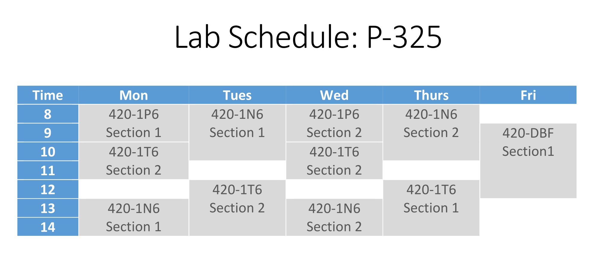

# MS Word Styles

Microsoft Word is a powerful word-processing program.

In this course we will assume that you are somewhat familiar with Word and we will focus on a few specific features.

## New or need a refresher?

If you are not already familiar with MS Word, please complete the following guides:

-   [Getting Started with Word](https://edu.gcfglobal.org/en/word/getting-started-with-word/1/) by GCF Global
    
-   [Creating and Opening Documents](https://edu.gcfglobal.org/en/word/creating-and-opening-documents/1/) by GCF Global
    
-   [Saving and Sharing Documents](https://edu.gcfglobal.org/en/word/saving-and-sharing-documents/1/) by GCF Global
    

## Tables in Word

📖 For this section of the notes please refer to the following resources:

- [Tables](https://edu.gcfglobal.org/en/word/tables/1/)

## Styles: Automated Formatting

MS Word allows for a multitude of formatting possibilities.

If the document is large with many sections, it can be very hard to keep track of the different formatting settings used in every element. **This makes it time consuming to create a consistent document.**

Using the Styles feature of Word automated the formatting task and helps create consistent documents.

> 📖 For this section of the notes please refer to the following resources by Microsoft;
> 
> -   [Use Quick Styles](https://support.microsoft.com/en-us/office/video-using-styles-in-word-9db4c0f4-2754-4294-9758-c14a0abd8cfa)
>     
> -   [Editing Styles](https://support.microsoft.com/en-us/office/editing-styles-00ef3db1-871d-4cf2-af49-e9c7768d7934)
>     
> -   [Different Styles and Themes](https://support.microsoft.com/en-us/office/different-looks-with-styles-and-themes-64849596-2cd2-4459-9a75-e42727522021)
>     
> -   [Insert a table of contents](https://support.microsoft.com/en-us/office/insert-a-table-of-contents-882e8564-0edb-435e-84b5-1d8552ccf0c0)
>     
> -   [Format or customize a table of contents](https://support.microsoft.com/en-us/office/format-or-customize-a-table-of-contents-9d85eb9c-0b55-4795-8abb-a49885b3a58d)
>     

For an excellent guide with step by step instructions:

> [Microsoft Office Word: Formatting Your Document](https://apps.kennesaw.edu/files/pr_app_uni_cdoc/doc/Word_2016_PC_Formatting_Your_Document.pdf) by Kennesaw State University

You are encouraged to download the zip file containing _SampleDoc.docx_ under Week 10 and follow along.

## Lab: Styles & Tables

In Moodle, download the file *What is a kanban board.docx* from **Lab: Styles & Tables** under Week 2.

**This assignment is worth 0.5% of your lab exercises grade**.

1.  Format the document using built-in styles.
 - Refer to the webpage [What is a kanban board?](https://www.atlassian.com/agile/kanban/boards) to understand the hierarchy of the sections.

2. Change the following built-in styles:
 - Increase the font size of heading levels 1, 2, and 3 by 4 pts
 - Make heading levels 1, 2 and 3 bold.
        
3.  Enable the Navigation Pane in your document.
    
4.  Insert an automatic page of contents at the beginning of the document.

5.  Create a new heading level 1 at the end of your document and name it "Appendix".

6.  Insert the table below inside "Appendix":  

7. Update the table of contents.

8. Upload your final document to Moodle under **Lab: Styles & Tables**