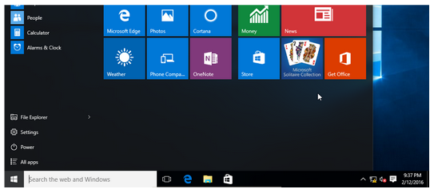

# Intro to Operating Systems

In this section we will take a look at how the operating system software interacts and controls the hardware.

Previously we had defined **software** as: *any **set of instructions** that tells the hardware **what to do** and **how to do it**.*

Let's focus on two types of software: **the operating system and application software**

 

**Operating System / System Software**

>  An operating system is a set of programs that:
>
> - Run inside the hardware,
> - manage the hardware resources,
> - host application software, and
> - provide a user interface

 

[

<a href="https://www.addictivetips.com/mobile/an-introduction-to-modern-mobile-operating-systems/"><em>Examples of Mobile Operating Systems</em></a>

 

**Application Software**

> Programs that run and execute instructions inside the operating system.

 

<a href="#"><em>Hosting relationship between Hardware and Software</em></a>

 

## Operating System Software

The operating system is mainly composed of different different types of software:

- The Shell, and
- The Kernel

### The Shell

The Shell is the outer layer of the operating system (OS).

It provides the user an interface in order to interact with the Kernel

 

<a href="https://aquaticarts.com/"><em>The OS Shell is what users see and interact with</em></a>

 

There are two categories of OS Shells:

#### Command Line Interfaces (CLI)

Provide a text-based interface to type and read commands

 

#### Graphical User Interfaces (GUI)

Provide graphical representations of files, folders, windows, icons, etc.

 

### The Kernel

The Kernel is the core component of the OS.

It manages and controls all system resources and makes them available to other software, including the Shell. 

It is the Kernel that manages requests to and from Input and Output devices (mouse, microphone, monitor, etc).

 

<a href="https://aquaticarts.com/"><em>The Kernel controls the OS</em></a>

 

Below is a simplified diagram of the operating system indicating the relationship between main software and hardware components:

 

<a href="#"><em>System components. Arrows show the direction of information exchange. OS is highlighted in yellow</em></a>

 

The Task Manger program is a graphical representation of the main resources managed by the Kernel:

- RAM and CPU allocation and usage
- Processes, services and programs running
- Access to the Storage Disc
- Access to the network card
- Etc.

 

 

## The Computer File System

Every single program, image, video, document, etc, exists in your computers as file located somewhere in the File System.

 

 

The computer file system is organized as a trees, where the origin of each tree is the **root directory**

In Windows, the root directories are assigned a letter and usually represent a Storage Drive.

 

<a href="#"><em>Windows file system with four root directories (A:, C:, D:, F:)</em></a>

 

Files systems normally contain:

- **Data** (the files)
- **Directories** (folders)
- **Metadata** (information about the data)
  - File size
  - File-type
  - Time modified

 

### File Types

Each file can hold information in a multitude of different formats.

For example, an image file stores image information in a completely different way than a text file.

> To quickly distinguish between the different types files, we use a file extension at the end of each file type

 

Here are some examples of file types and their extensions:

| **Images** | **Documents** | **Audio** | **Video** | Compressed files |
| ---------- | ------------- | --------- | --------- | ---------------- |
| .png       | .docx         | .mp3      | .mp4      | .rar             |
| .jpeg      | .txt          | .wav      | .avi      | .zip             |
| .gif       | .html         | .flac     | .webm     | .7z              |

 

### File Manager Software

> A File Manager is an application software that helps us navigate, find, organize and manage files and folders in file system.

Windows' default file manager is the **File Explorer** program.

 

 

### Showing file extensions

By default File Explorer hides the file extensions.

 

 

Microsoft choose to do this to simplify the user interface and not overwhelm new users.

**If you would like to see the file extensions directly on File Explorer you have to enable it**

Enabling file extensions is not necessary but it will allow you to better understand what kinds of files you are dealing with "under the hood".

 

 

To enable the file extensions in File Explorer select the *View Menu* and click on the *File name extensions* check box.

 

 

### File Properties

To view in-depth information about a file you can open it's properties dialogue.

From File Explorer, right-click on the file and select ***Properties***

 

 

## Compressed Files

> Some files in the computer can be compressed in order to save space. 
>
> Compressed files are typically called **Zipped files**.

 

In order to compress a file you need a **File compressor program**. 

**Windows comes with a File Compressor program by default** but you can choose to install other programs that achieve the same task.

 

Here are some examples of the File Compression programs and their respective file formats:

 

| Name of Compression Program              | Compressed file extension |                             Icon                             |
| ---------------------------------------- | :-----------------------: | :----------------------------------------------------------: |
| Windows Default Compressor               |           .zip            |  |
| 7-Zip                                    |            .7z            |  |
| WinRAR (**not accepted for submission**) |           .rar            |  |

 

### Zip and Unzip Files

To zip (compress) or unzip (extract) files follow the instructions below:

#### Compressing Files	

1. Locate the file or folder that you want to zip.

2. Right-click the file or folder, select **Send to**, and then select **Compressed (zipped) folder**.

A new zipped folder with the same name is created in the same location.  To rename it, right-click the folder, select **Rename**, and then type the new name.

 

 

#### Extracting Files

1. Locate the zipped folder that you want to unzip (extract) files or folders from.

2. Do one of the following:

- To unzip a single file or folder, open the zipped folder, then drag the file or folder from the zipped folder to a new location.

- To unzip all the contents of the zipped folder, right-click the folder, select **Extract All**, and then follow the instructions.

   

 

#### ⚠ Using Zipped "Folders"

> The contents inside a zipped file are READ-ONLY!
>
> You will not be able to modify them without extracting first.

 

In windows you have the ability to double click onto a zipped file and File Explorer will show you the contents of the zipped file **as if you were inside a folder** - it's a trap!

  This can be very misleading and stressful when working on assignments or tests.

**Please get into the habit of always extracting a compressed file before working on it.**

 

## Exercise - File Compression

In Moodle, you will find  **Practice Assignment** (not worth any marks) under Week 2. Please refer to that activity in order to complete the following steps:

 

1. Download the file: ***File Compression***

2. Decompress it in a location of your choice

3. Make note of the file size of each file. You will need this information in step 9.

4. Organize the files into folders:

   - Create a main folder named ***Practice1***. This will be the top level directory for the next steps.

   - Create the file structure shown below (only directories are shown).

      

     

    

5. Place files in their respective folders, according to their file type.

6. Compress each file individually.

7. Take note of the file size after compression. You will need this in step 9.

8. Remove any uncompressed files.

9. What files have the the best and worse file compression ?

   - Use the file size to calculate the compression ratio. You can use ratio = 1- final / initial.

10. Write down the compression ratios for each file in a file of  your choice (ex. a spreadsheet, Word file, txt file, picture, etc.)

11. Include this document in the top level folder for this activity (Practice_1).

12. Compress the top level directory *Practice 1.*

13. Upload the final compressed folder to Moodle under **Practice Assignment**.