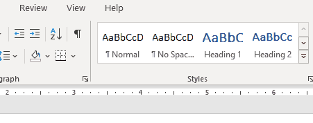

# Collaborating: Comments & Changes

An important aspect of collaborating effectively is providing comments and change suggestions to someone's document.

In this section we will look at how to add comments to a Word document as well as how to suggest non-permanent edits and how to invite others to co-edit.

## References & Guides

> 📖 For this section of the notes please refer to the following resources from Microsoft:
> 
> -   [Insert or delete a comment](https://support.microsoft.com/en-us/office/insert-or-delete-a-comment-8d3f868a-867e-4df2-8c68-bf96671641e2)
>     
> -   [Track changes in Word](https://support.microsoft.com/en-us/office/track-changes-in-word-197ba630-0f5f-4a8e-9a77-3712475e806a)
>     
> -   [Accept tracked changes](https://support.microsoft.com/en-us/office/accept-tracked-changes-4838d24c-d5d1-4c6c-8e39-78b44bd2b4cc)
>     
> -   [Share a document](https://support.microsoft.com/en-us/office/share-a-document-d39f3cd8-0aa0-412f-9a35-1abba926d354)
>     
> -   [Collaborate on Word documents with real-time co-authoring](https://support.microsoft.com/en-us/office/collaborate-on-word-documents-with-real-time-co-authoring-7dd3040c-3f30-4fdd-bab0-8586492a1f1d)
>     

## Choose the Markup View

It's possible to select what kind of suggestion markup will be shown.

For example, you may choose to show:

-   **Original:** Only the original text without any suggestions or comments;
    
-   **No Markup:** To show what the text will look like if all suggested changed were incorporated.
    

> For more details, see the reference [Track changes in Word](https://support.microsoft.com/en-us/office/track-changes-in-word-197ba630-0f5f-4a8e-9a77-3712475e806a)

## Lab: Collaborative Editing

**This lab is worth 0.5% of your lab exercises grade**.

> This lab builds on top of the previous week 3 lab: **Lab: Tabs, pages, images & review**

**Part A: Upload & share**

1. Download from Moodle the work you had previously submitted for the week 3 lab:  **Lab: Tabs, pages, images & review**
2. Use OneDrive to upload your *Internship-Programs.docx* document to the cloud in a location of your cloice.
3. Share your document for reviewing with a colleague as specified by the teacher.

**Part B: Provide edits & comments**

Once a colleague has shared their work with you, apply the next steps **to your colleague's document.** You now have the role of an editor.

4. If necessary, change the change tracking mode to show all markup.
5. Start tracking your changes to the document.
6. Provide at least 2 comments on how to improve the document.
	1. This can include different language or layout changes
	2. Do do edit the document, just add comments.

7. Make at least two modifications to the text (make sure changes are being tracked).
8. Make at least two formatting modifications.
9. Let your colleague know once you are done with the changes.

**Part C: Responging to comments and changes:**

Once your editor is done providing comments and suggestions, apply the next steps **to your own document**:

10. Respond to all the comments in the document.
11. Reject or accept most edit modifications **except for two**.
12. Upload your document to Moodle under week 3: **Lab: Collaborative Editing**
13. Call the techer to have your lab graded before you leave.