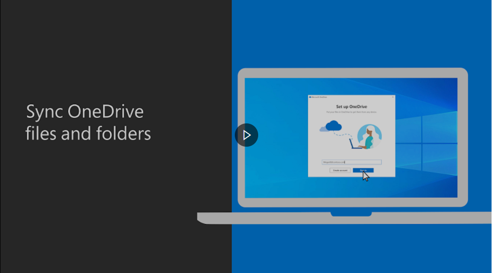
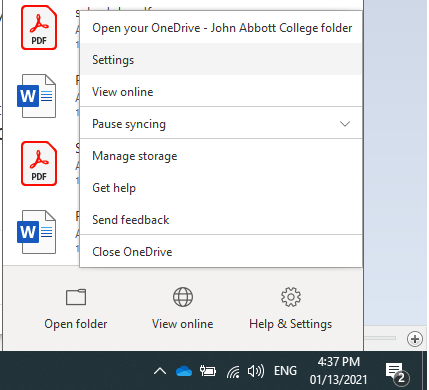
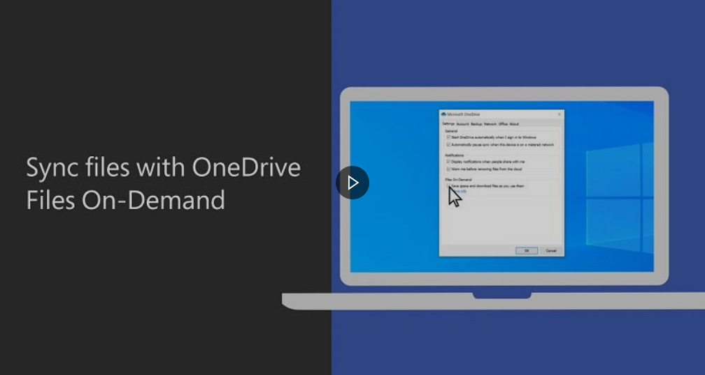
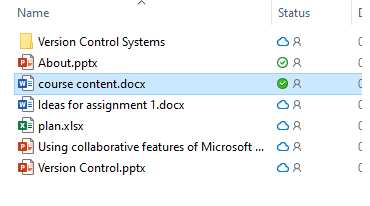
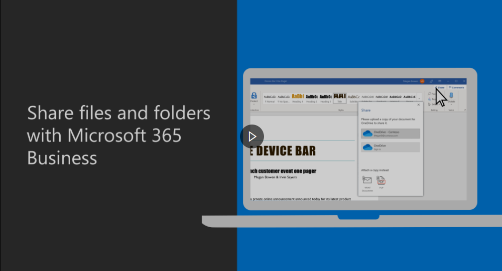
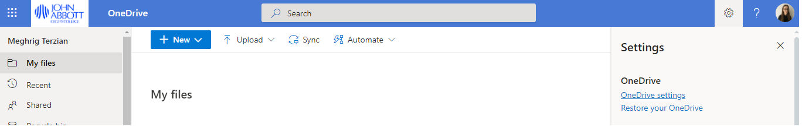
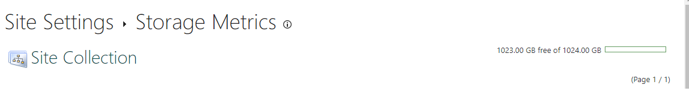
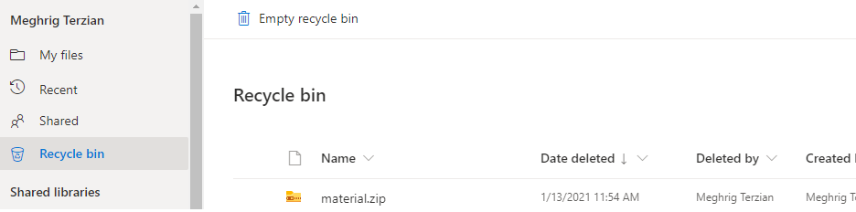

# Sync files with OneDrive

## Objectives

-   Download, install and setup OneDrive
    
-   Sync files with OneDrive
    
-   Collaborate & share with OneDrive
    

### Step 1: Download, Install and Set up

 

1.  If you don't have OneDrive app on your machine, [download](https://www.microsoft.com/en-ca/microsoft-365/onedrive/download) and install it.
    
2.  Open the OneDrive app and set up your account by logging in using your school account [ID]@johnabbottcollege.net.
    
3.  You can change the folder location of OneDrive during setup.
    
4.  To choose which folders you're syncing, right-click the **blue cloud icon** in the taskbar notification area, and select **Settings** > **Account** > **Choose folders**.
    	
 

 

5.  Create folder **1B4** in the OneDrive folder location.
    
6.  **1B4** should appear on OneDrive now.
    

## Step 2: File Status

Create 3 files (excel, word, PowerPoint) in **1B4** folder and give them 3 different statuses.

### Step 3: Share & Collaborate

> When you right click on 1B4 folder in file explorer, notice that you have 5 new actions in the context window (Share, View online, View history, Always keep on this device, and Free up space)

1.  Right click on **1B4** folder, choose Share and explore the options.
    
2.  Choose Anyone with the link, give editing permissions, and set expiration date 25/01/2021.
    

### Step 4: Space

1.  Go to **settings** and then **One Drive settings**.

    
2.  On the left side go to **More Settings**. Under the Features and storage area click Storage Metrics

3.  How much space do you have?
    

## Step 5: Restore deleted files or folders in OneDrive

Similarly, to restore files or folders that you have deleted from your computer, go to your machine's recycle bin.

Delete a file from OneDrive and try to restore it.

### Resources

-   [Sync files with OneDrive in Windows](https://support.microsoft.com/en-us/office/sync-files--%20with-onedrive-in-windows-615391c4-2bd3-4aae-a42a-858262e42a49)
    
-   [Save disk space with OneDrive Files On-Demand for Windows 10](https://support.microsoft.com/en-us/office/save-disk-space-with-onedrive-files-on-demand-for-windows-10-0e6860d3-d9f3-4971-b321-7092438fb38e)
    
-   [Share OneDrive files and folders](https://support.microsoft.com/en-us/office/share-onedrive-files-and-folders-9fcc2f7d-de0c-4cec-93b0-a82024800c07)