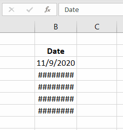
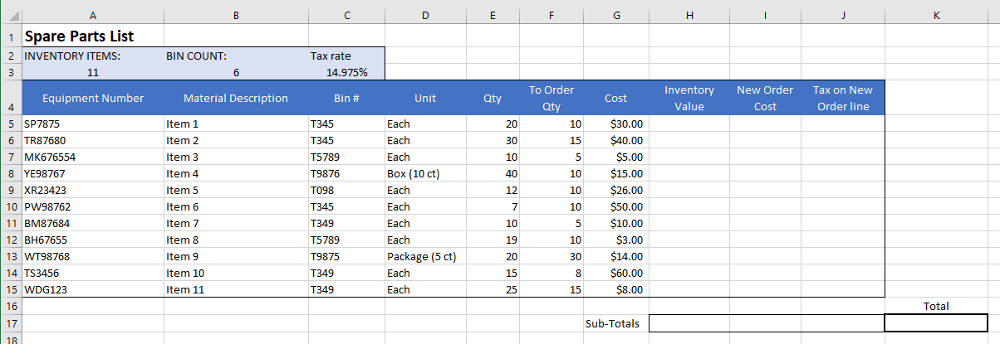

# Intro to Spreadsheets

Spreadsheets are a way of storing and processing data in a table format.

There are many examples of spreadsheet software such as:

- Microsoft **Excel**
- Google **Sheets**
- Apple **Numbers**s
- LibreOffice **Calc**

## New or need a refresher?

A spreadsheet can have one or more sheet. Each sheet contains **multiple cells** and all the cells are **organized in columns and rows**.

In this course we will focus on using Excel, however, 90% of the functionality we will use is also available in Google Sheets.

 

If you are not already familiar with MS Excel, please complete the following guides from GCF Global:

- [Getting Started with Excel](https://edu.gcfglobal.org/en/excel/getting-started-with-excel/1/)
- [Formatting Cells](https://edu.gcfglobal.org/en/excel/formatting-cells/1/)

## Intro to Excel

> 📖 For this section of the notes please refer to the following resources from GCF Global
>
> - [Understanding Number Formats](https://edu.gcfglobal.org/en/excel/understanding-number-formats/1/)
> - [Intro to Formulas](https://edu.gcfglobal.org/en/excel/intro-to-formulas/1/)
> - [Relative and Absolute Cell References](https://edu.gcfglobal.org/en/excel/relative-and-absolute-cell-references/1/)

 

Each of the resources shared above include a **practice workbook that we will complete in class**.

## Content & Cell width

In certain cases, **if the cell's width is narrower than it's contents**, you might see repeated "#" characters.

To properly display the cell contents, simply make the cells wider.

## Diving Deeper (optional)

For fun Excel projects, check the page [9 Amazing Projects Made in Microsoft Excel](https://mashable.com/2014/08/19/microsoft-excel-cool-projects/)

## Exercises

Download the Excel file *intro-exercises.xlsx* available in Moodle under Week 4.

### Exercise 1

Refer to the sheet *spare part list*

1. Format the sheet so that it looks **similar** to the example below:

2. Calculate the following missing values using excel formulas  only:
   1. Inventory Value
   2. New Order Cost
   3. Tax on New Order Line
   4. All sub-totals
   5. The total of the New Order Cost plus the tax on all new orders

### Exercise 2

Refer to the sheet *density*:

1. Calculate the density for each measurement

### Exercise 3

Refer to sheet *UnknownLiquid*

1. Calculated all missing values (identified by light yellow fill)
2. Calculate the average density using a built-in equation.