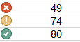

# Sorting, Filtering & Conditional Formatting

> 📖 For this section of the notes please refer to the following resources from GCF Global
>
> - [Using Find & Replace](https://edu.gcfglobal.org/en/excel/using-find-replace/1/) 
> - [Freezing Panes and View Options](https://edu.gcfglobal.org/en/excel/freezing-panes-and-view-options/1/) (not including split views)
> - [Sorting Data](https://edu.gcfglobal.org/en/excel/sorting-data/1/)
> - [Filtering Data](https://edu.gcfglobal.org/en/excel/filtering-data/1/)
>   - For Mac users, see *Create a custom list to sort by* in [Sort a list of data in Excel for Mac](https://support.microsoft.com/en-us/office/sort-a-list-of-data-in-excel-for-mac-3b0e62c1-ef88-4176-babb-ccf1cb1e6145)
> - [Conditional Formatting](https://edu.gcfglobal.org/en/excel/conditional-formatting/1/)

Each of the chapters shared above include a practice workbook that we will complete in class.

## Be careful with Auto-sorting ⚠

> Be careful when sorting data and make sure that related fields are moving along with the data being sorted.    

In the animation below, notice how the selected range is the only  thing being sorted. The neighbouring data that is related to those cells are not being sorted.

 

This happens because there are two types of sorting:

### Sort sheet

Sort sheet organizes all the data according to one column. **The rows move together.**

To use a sort sheet select a cell in the column you want to sort.

### Sort range

Sort range organizes the data in a specified range of cells. **Only the cells in the specified range get arranged.**

To use a sort range select a range you want to sort.

## Exercises

### Exercise 1

Complete the challenge at the end of the[ guide **Sorting Data** ](https://edu.gcfglobal.org/en/excel/sorting-data/1/) with the modified step below:

**Modified Step 4:**

Create a sort for the Additional Information section. Sort by Counselor (Column H) **from Z to A.**

### Exercise 2

Complete the challenge at the end of the [guide **Filtering Data**](https://edu.gcfglobal.org/en/excel/filtering-data/1/).

### Exercise 3

Complete the challenge at the end of the [guide **Conditional Formatting**](https://edu.gcfglobal.org/en/excel/conditional-formatting/1/) with the additional steps below:

**Step 8 - **change the icon set rules to display the following:

- ❌  for grades **below 50**.
- ❕ for grades  **greater than or equal to 50 and below 80**.
- ✔ for grades **greater than or equal to 80**.

**Step 9** - Make it so the grades that define the icon-set rules can be changed as cell values