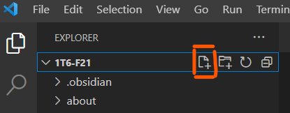
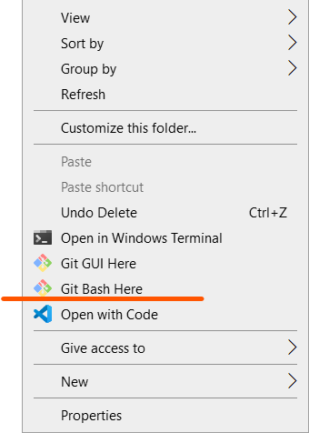

# Bash Scripting

A script is a simple text file that contains multiple shell commands that can be executed sequentially.

>
> In **Bash**, a script has the following characteristics:
> - The **file extension .sh**
> - The first line of your file must include `#!/usr/bin/env bash` (aka. shebang)


The shebang is used to tell the operating system which type of shell must be used to interpret the commands.

## Creating bash scripts

Since a bash script is a simple text file, it can be created with any text editor that lets you save a .sh file.

> The recommendation for this course is to use Visual Studio Code.

To create a script in VS Code:

1. Select *File > Open Folder...* (don't open files individually)
2. Choose the folder that will contain your project
	- A project is a collection of one or more files
3. Once that folder is created, select the symbol for creating a new file
4. Name your file with the extension you need
	- Ex. *my-script.sh*



## Running Scripts

### 1. Make script executable

The first step is to make the bash script you created an "executable" file.

This is a security feature so that random files are not executed with potentially malicious code.

Simply run the command `chmod +x`  followed by your filename.

```bash
$ chmod +x my-script.sh

```

### 2. Run your file

To run the script specify the file path to the file (relative or absolute).

In the example below the file path includes `./` because the script is in the same directory as the shell session.

```bash
$ ./my-script.sh
```

**Notes**
- All the commands in the script will be executed from the directory location that called the script.
- The symbol `$` represents your prompt, do not type it with your command.

## Bash Scripts in Windows

Install [Git for Windows](https://gitforwindows.org/) in order to run bash in Windows.

Git for Windows comes with other tools that we will not use in this course.

**To open any folder in Git Bash:**
1. Navigate to the folder in File Explorer
2. Select *Git Bash Here*

