# Intro to the Command Line Shell

We saw that the operating system is made of a Kernel and a Shell.

Most users first interact with a computer via a graphical shell (or GUI - graphical user interface) since it's easier to learn. However, the CLI (command line interface) Shell offers more flexibility and the ability to automate tasks.

<br>

> Operating systems usually have a single Kernel running at a given moment.
>
> However, **there can be multiple CLI Shells running and communicating with the Kernel.**

<br>

Windows 10 typically comes with two CLI shells installed by default: the CMD (Command Prompt) shell and PowerShell.

The CMD shell has been around since the 80's and is easier to learn. However, we will focus on the PowerShell since it is more modern, offers greater flexibility and it can also be installed in Linux and macOS.

<br>

## The File Path

It's often the case that commands executed in a CLI Shell need to know the location of a particular file or directory.

> To specify the exact location of anything in the file system we need to specify the file path.
>
> The file path is a specific route in your file system which tells commands where to go.

<br>

When using the graphical File Explorer to navigate the file system we can click in the navigation bar to see the file path.

In the example below the file path to the contents of the `File compression` folder is:

`C:\Users\mauri\Downloads\File compression`

<br>


<br>

Since computers can only do exactly what they are told, file paths must be exact and cannot contain errors.

Most common mistakes include:

- "File Location does not exists"
- "File Location already exists"

<br>

### Breaking down the file path

A file path is typically composed of the following sections:

- The starting root directory

- A series of folders

- A file name with it's respective file extension.

  <br>

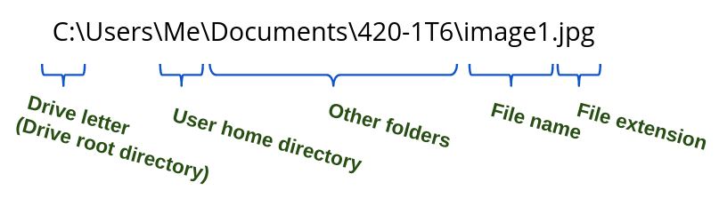

<br>

Windows, macOS and Linux use the concept of "**user home directory**". This is a folder created for each user registered in the system and contains files that are unique to each user.

For example, in Windows, the folders *Downloads, Documents, Pictures, Videos* and *Desktop* are all located inside the user's home directory.

> In Windows, the file path of the user home directory is:
>
> C:\Users\specific_user

<br>

### ⚠ "This PC" in Windows

In order to help the user find commonly used folders, File Explorer uses the **misleading concept of "This PC"**.

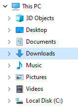

<br>

By looking at the image above a user might think that "This PC" is a directory in the file system which contains other directories such as *Desktop, Documents, Downloads, Music, Pictures,* *Local Disk (C:)*, etc.


However, we already know that the *Locak Disk (C:)* is a root directory in the file system. How can it be located under "This PC"?

<br>

> The directory "This PC" does not exists in the Windows file system.
>
> It is a shortcut that groups other directories for the convenience of the user.

<br>

## Intro to PowerShell

> If you would like to follow along, [download this zip](https://drive.google.com/file/d/1RT_udFW60bUXFKr_oazVvibkICnMGtXH/view?usp=sharing) with the files and folders used in the examples.


### Launching PowerShell

1. Search for PowerShell in the **Windows search bar**.

   - To run it as "Administrator" you could right-click and select "Run as Administrator" or find that option directly on the right.

     <br>
	 
	 

<br>

2. PowerShell window opens:

   <br>

   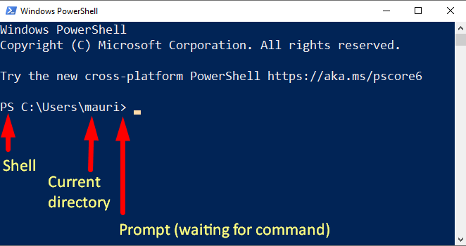

<br>

In this window you can see what kind of shell you are using (PS stands for PowerShell) and where in the file system you are "sitting".

When you see the prompt (">" symbol), it means that PowerShell is waiting for a command.

<br>

### Executing Cmdlets

In PowerShell a built-in command is called a **cmdlet** (pronounced "command-let"). There are hundreds of cmdlets, we will only use a dozen of them for now.


> For consistency a cmdlet always consists of a **verb and a noun**, separated with a hyphen.

Some common verbs (not full commands)

- **Get** — To get something
- **Start** — To run something
- **Out** — To output something
- **Stop** — To stop something that is running
- **Set** — To define something
- **New** — To create something 


Next time you are using a new command, try to guess what it does from the name.
<br>

#### Get-Command

To see a list of all available command in PowerShell you can use the cmdlet `Get-Command`.

The output is organized in four columns. Looking at the first two:

- *CommandType* describes the type of the command (Alias, Function or Cmdlet). Functions and Cmdlets are slightly different but we will consider them both as executable commands for now. Aliases will be covered below.

- *Name* is what you would type in order to use the command.

<br>

#### Get-ChildItem (ls)

As mentioned above, PowerShell always includes the current path in the prompt. To know the contents of the current directory you can use the cmdlet `Get-ChildItem`.

This command will give you a list of all files and folders inside the current folder.

<br>

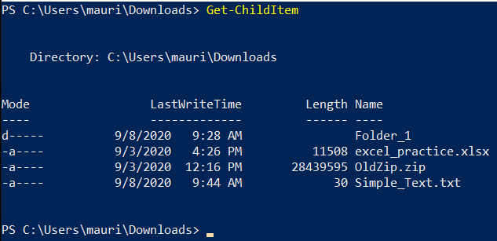

<br>

By default `Get-ChildItem` lists the mode (**Attributes**), **LastWriteTime**, file size in bytes (**Length**), and the **Name** of the item. The letters in the **Mode** property can be interpreted as follows:

- `l` (link)
- `d` (directory)
- `a` (archive)
- `r` (read-only)
- `h` (hidden)
- `s` (system)

<br>

#### Get-Help (man)

This command givers you access to the documentation (instructions manual) of other commands.

It is extremely useful when trying to understand what other commands do and how to use them.


> By default, only a small section of the documentation is installed in the system.
>
> Before we can learn from Get-Help we need to download and install the help files.
>
> Run the cmdlet: `Update-Help` as Administrator.

<br>

If you run the cmdlet `Get-Help` by itself you will get it's default behavior, which is to display information about the PowerShell Help System (including the `Get-Help`).

However, `Get-Help` is most useful when run with arguments and/or parameters.

<br>

### Arguments

Most commands will have a default behavior, however, in order to be flexible and truly useful they need additional instructions on **how or where** to execute. 

These additional instructions come in the form of parameters and/or arguments.

> An argument is a piece of extra information provided to the command that specifies the "target" of the command.

For example, the `Get-Help` command is commonly executed by specifying "on which command" (the target) we would like to have more information.

```powershell
Get-Help Get-Command
```

 If you ran the line above you will see the help file for the `Get-Command` cmdlet.

That is because we are specifying `Get-Command` as an argument to the `Get-Help` command.

<br>

#### Set-Location (cd)

Use the command `Set-Location` to move to a different directory in your file system. **This cmdlet takes one argument, which is the directory to move into**.

<br>

It is common to use this command after `Get-ChildItem` , since the later will show you what are your available options.

<br>

If the directory you would like to move into is sitting immediately inside the current directory, you can simply specify the name of the new directory. This way, the complete file path is note required.

<br>

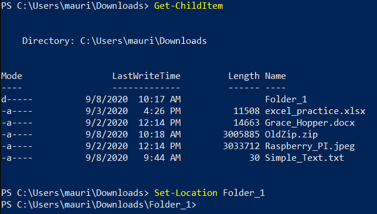

<br>

**To move back "up" to the parent directory** you can use the "double-dot" `..` notation (more on this later)

<br>

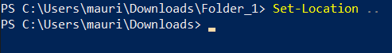

<br>

To move to anywhere else in the file system that is not immediately above or below the current directory, specify the full path:

<br>

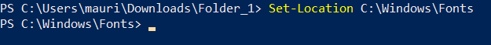

<br>


#### Move-Item (mv)

The cmdlet `Move-Item` can move files or folders in the file system.

This cmdlet needs two arguments.

- The first argument specifies the file to be moved
- The second argument specified the final location (where it will be moved to).

<br>

For example, to move the file `Simple_Text.txt` located at `C:\Users\mauri\Downloads` to the location `C:\Users\mauri\Downloads\Folder_1` :

```powershell
Move-Item C:\Users\mauri\Downloads\Simple_Text.txt C:\Users\mauri\Downloads\Folder_1
```

<br>


<br>

#### Copy-Item (cp)

`Copy-Item` can be used to copy an item and it works similarly to `Move-Item`

The cmdlet takes two arguments

- 1st argument: the file to be copied
- 2nd argument: the location to be copied.

<br>

### Parameters

Parameters are special "request" added to a command which **specify a variation on how to execute** the command.

For example, the cmdlet `Get-Help` will typically list a summary of the help article for a specified command.

However, `Get-Help` can also be used with the following special parameters:

- `-Online`
  - Displays the online version of a help article in the default browser.
- `-Full`
  - Displays the entire help article for a cmdlet.
- `-Examples`
  - Displays only the name, synopsis, and examples for a cmdlet

<br>

If we wanted to see examples for the `Move-Item` cmdlet we would execute:

```powershell
Get-Help Move-Item -Examples
```

<br>

If we wanted to see the online version of the help article for the `Get-ChildItem` cmdlet:

```powershell
Get-Help Get-ChildItem -Online
```

<br>

#### Remove-Item (rm)

The `Remove-Item` cmdlet deletes one or more items.

This cmdlet takes a minimum or one argument, which is the file to be deleted.

<br>

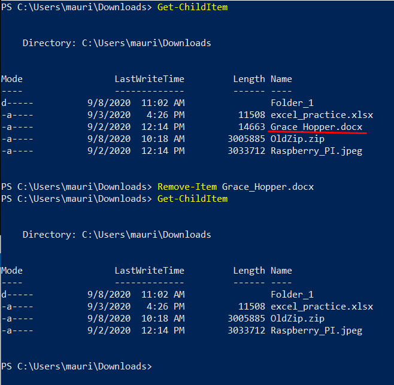

<br>

If you would like to delete a folder and all it's children (files and folders inside that folder) you can specify the parameter `-Recurse`

```powershell
Remove-Item Folder_1 -Recurse
```

<br>

If you do not specify this parameter the cmdlet will ask you for your permission and will wait for an answer. This is highly undesirable if you are trying to write an automated script that should run without supervision.

<br>

### Tab Auto Complete

When entering a cmdlet or a file path, you can press the `Tab` key at any time to auto-complete.


<br>

### Clear Screen (`ctrl` + `L`)

To clear the current screen:

- Press: Ctrl + L, or
- Type `cls`, or `clear`

<br>

### Alias for Command Shortcuts

PowerShell commands are long since they use a verb-noun convention. To make it faster to use PowerShell, most commands have a "short-form" know as alias.

>  An **alias** is simply a different name for the same command.

Below are a few aliases for common cmdlets:

| PowerShell Command | Aliases      |
| ------------------ | ------------ |
| Get-Command        | gcm           |
| Get-ChildItem      | gci, ls, dir |
| Get-help           | help         |
| Set-Location       | cd           |
| Move-Item          | mv           |
| Copy-Item          | cp           |
| Remove-Item        | rm           |

<br>

#### Get-Alias

To see a full list of all the aliases in PowerShell run the command `Get-Alias`

If you would like to check which "verb-noun" command is invoked by an alias use `Get-Alias <alias>`.

For example, to see  the full PowerShell "verb-noun" command behind the `rm` alias:

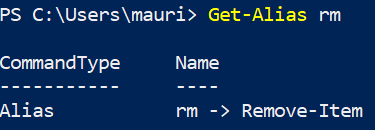

<br>

To see if a "verb-noun" command has an alias, you can add the `-Definition` parameter to the `Get-Alias` command.

For example, to see the aliases for the `Set-Location` command:

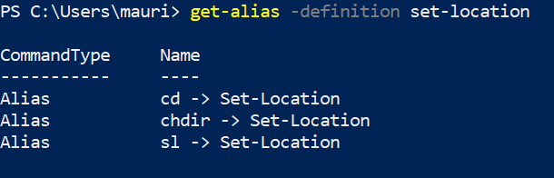

<br>

### Empty spaces in file paths

When entering a file path that **contains spaces**, it is important to **add double or single quotes around the file path**.

For example:

When trying to navigate to `C:\Users\mauri\3D Objects`  in PowerShell:

```powershell
Set-Location 'C:\Users\mauri\3D Objects'
```

<br>

If single or double quotes are not added, the command will interpret that the argument provided ends at the line space. After all, we use spaces to tell PowerShell that we are entering multiple arguments.

<br>

To move a file from `Downloads` to `3D Objects` we would execute the following command:

```powershell
Move-Item C:\Users\mauri\Downloads\Raspberry_PI.jpeg 'C:\Users\mauri\3D Objects\'
```

<br>

Notice how the first argument (the item to be moved) did not have quotes around it. However, the second argument did (the location) since it contained a file path with empty spaces.

<br>

## Relative vs Absolute File Paths

So far we've only used absolute paths in the command line.

> An **absolute path** is a path that starts at a root directory.

For example, the path to the image `C:\Users\mauri\Downloads\Raspberry_PI.jpeg`  starts from the root directory `C:`

This means that regardless of the current directory (listed in the prompt), a command will always find it's way to the file.


> **A relative path** describes a location in the file system based on the current location (current directory).
>
> To give relative locations we use two symbols: `.` ("dot") and `..` ("double-dot").
>
> `.`  represents the current directory
>
> `..`  represents the parent directory


In the section above for the **Set-Location** command we used `..` to move back up one directory:


<br>

Since we were inside `Folder_1` and it is a child of `Downloads`, we simply asked PowerShell to move us from the current directory (`Folder_1`)  to it's parent (`Downloads`).

<br>

It is common to use the `Tab` key when specifying the directory to move into (with the `Set-Location` command):

<br>

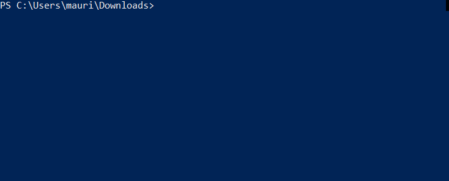

<br>

Notice that when `Tab` was pressed, PowerShell autocompleted the file path from just `Fol` to `.\Folder_1\`.

The `.` was added because we the file path is **relative to the current directory**.

In other words, we are saying: "from the current directory, move inside `Folder_1`"

<br>

Consider the following directory structure:

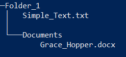

 <br>

If we were sitting inside `Documents` and we wanted to move the file `Grace_Hopper.docx` to `Folder_1`, we could use relative paths:

<br>

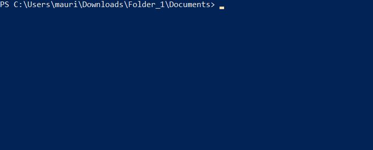

<br>

It is possible to combine relative file paths multiple times:

```powershell
PS C:\Users\mauri\Downloads\Folder_1\Documents> cd ..\..
PS C:\Users\mauri\Downloads>
```

Notice how we moved "up" to the parent directory twice, once for every `..` 

<br>

## Wild card *

> In the command line the symbol  `*`  is used as a wild card to match zero or more characters.

It is similar to a card game where the joker can assume the role of any other card.


<br>

For example, if we were in a directory and wanted to see the list of all .txt files (but nothing else), we could use `Get-ChildItem *.txt`

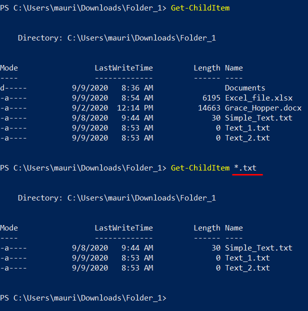

<br>

In the list above the wild-card `*`  "took-on" the value of any series of characters (ei. the file names) followed by the extension that we specified (`.txt`).

<br>

In a similar way, we could moved all the `.txt` files to `Folder_1\Documents`:

```powershell
Move-Item *.txt .\Documents
```

<br>

### User's home directory ~

The home user directory is a very common location in the file system of an user.

> The symbol **~** (tilda) is a special symbol to represent the user's home folder.
>
> ~ means C:\Users\user_name

A user  can use ~ anytime in the command like to **refer to the home directory as a file path**:

```powershell
PS C:\Windows\System32> cd ~
PS C:\Users\mauri>
```

<br>

Similarly, we moving the image "photo_1.png" to the user's "Pictures" folder, which is under the user's home directory:

```powershell
PS C:\Users\mauri\Downloads\Assign1\file_compression> mv .\photo_1.png ~\Pictures\
```

<br>

## Diving Deeper

We've only scratched the surface of what PowerShell can do.

The page [**Introduction to the Windows Command Line with PowerShell**](https://programminghistorian.org/en/lessons/intro-to-powershell)  goes into more detail and is an excellent reference.