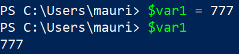
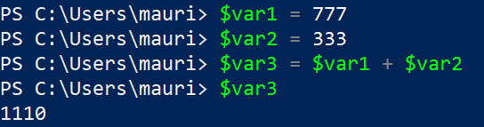
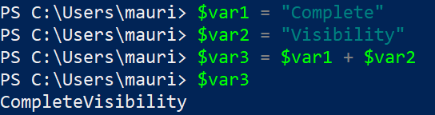

# Scripting with PowerShell

So far we have only used commands individually, one at a time. The power of a command line shell comes from the ability to run several commands in a row.

> A script is a text file that contains multiple shell commands that can be executed sequentially.
>
> In <u>PowerShell specifically</u>, a script is a text file that ends with the **file extension .ps1**


To illustrate this, open Notepad and add the following:

```powershell
Write-Host "Hello World!"
```

When saving the file, choose any name but make sure to save it with the extension .ps1

*Note: make sure you have "File name extensions" enabled in File Explorer, otherwise you cannot modify the file extension and your final file name will be script_name.ps1.txt* 

<br>

Then open PowerShell and navigate to the directory where you saved your script. 

To run the script use the `&` (the ["call" or "invocation" operator](https://docs.microsoft.com/en-us/powershell/module/microsoft.powershell.core/about/about_operators?view=powershell-7#call-operator-)) followed by the file name.

You must specify the file path to the file (relative or absolute):

```powershell
PS C:\Somewhere> & .\script_name.ps1
```

<br>

If you get a `SecurityError` due to `UnauthorizedAccess` , this means that PowerShell tried to execute your file but PowerShell has not been setup to run unknown scripts.

>  This is a security feature done by design and you must bypass it by modifying your **Execution Policy**

Microsoft has chosen to not let users run scripts by default because an un-informed user could accidentally run a malicious script.

<br>

## PowerShell ISE

To modify your execution policy and learn about the **PowerShell ISE** follow the link below:

> 📖 For this part of the notes, refer to:
>
> Section **[PowerShell Scripts](https://www.guru99.com/powershell-tutorial.html#10)** onwards of the page Powershell Tutorial for Beginners by Guru99


<br>

## PowerShell Variables

It is possible to use variables in PowerShell by using the "$" (dollar sign).

To assign a value to a variable, we use the “=” operator. To display the value of a variable, simply enter the variable.

<br>



<br>

You can perform arithmetic operations over numbers:



<br>

It is also possible to store strings inside variables by wrapping words in " " (double quotes).

Two or more string variables can be combined with the "+" operator.



<br>

### User's home directory ~

The home user directory is a very common location in the file system of an user.

> The symbol **~** (tilda) is a special symbol to represent the user's home folder.
>
> ~ means C:\Users\user_name

A user  can use ~ anytime in the command like to **refer to the home directory as a file path**:

```powershell
PS C:\Windows\System32> cd ~
PS C:\Users\mauri>
```

<br>

Similarly, we moving the image "photo_1.png" to the user's "Pictures" folder, which is under the user's home directory:

```powershell
PS C:\Users\mauri\Downloads\Assign1\file_compression> mv .\photo_1.png ~\Pictures\
```

<br>

## Exercises

Open the [Tutorial's Point PowerShell page](https://www.tutorialspoint.com/powershell/index.htm) and complete the following examples:

<br>

> - Some examples might require you to create some files before manipulating them.
>   - See the second example in the list below to learn how to do that.
> - If the file paths used in the examples do not exist in your file system, adjust them to an existing directory.


[Files and Folder Operations Examples](https://www.tutorialspoint.com/powershell/powershell_files_folders.htm) (Sr.No.):

- 1 - Creating Folders
- 2 - Creating Files
- 4 - Copying Files
- 10 - Rename Files

[File I/O Operations Examples](https://www.tutorialspoint.com/powershell/powershell_files_io.htm) (Sr.No.):

- 1 - Create Text File
- 5 - Create CSV File *(Try opening the you have created in Excel )*
- 9 - Erasing file content
- 10 - Append Text Data

<br>

## Diving Deeper

PowerShell ISE has some very useful features such as:

- Debugging
- IntelliSense
- Run Selection (just a section of your script)

To learn more about these features I recommend reading the following guide:

[Windows PowerShell ISE Tutorial](https://www.spguides.com/powershell-ise/) by Bijay Kumar

