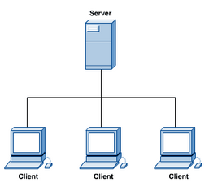
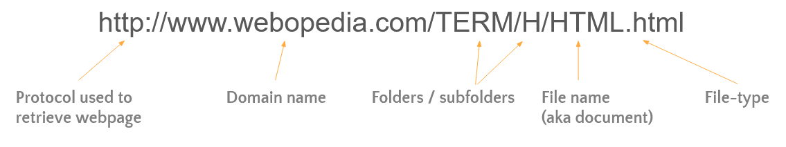
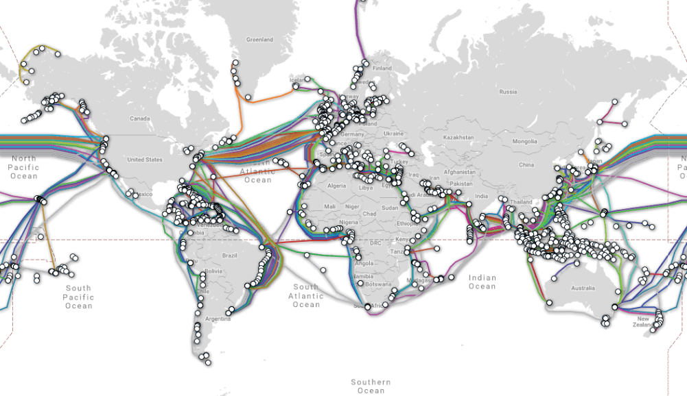

# Internet Protocols

In this section we will look at the different protocols that enable the information exchange on the internet.

> A protocol is a  language that computers mutually agreed to use in order to talk to each other. 

Many of the internet protocols used today have been part of the internet since it's design. 

<br>

## Origins of the Internet

The Internet was created in the 60's as a collaboration between military and scientific groups.

Initially it only connected a few institutions between the east and west coast of the US but it quickly grew to connect nearly the entire country.

<br>


<p align="center"><a href="https://paleofuture.gizmodo.com/the-rise-and-fall-of-the-arpanet-1969-1989-in-one-gif-1258090851"><em>Connection evolution of ARPANET</em></a></p>

<br>

### Internet vs World Wide Web

Most people consider the Internet and the World Wide Web to be the same thing. However, they are not.

**The Internet** is the worldwide **network of computers** built on common standards. In other words, the Internet is the network's physical infrastructure that connects the computers (cables, routers, switches, etc.).

**The World Wide Web (WWW)** is the **service** that runs on this infrastructure. For example, the ability to request a page and have it delivered to you is a service.

> The internet is the hardware and the WWW is the software.

### Origins of the World Wide Web

In the 60's two scientists, Ted Nelson and Douglas Engelbart, independently created a hypertext language that enabled users to browse a hyperlinked set of poems and typed discussions. These hyperlinked documents were limited to a single computer.

**Tim Berners-Lee** built on this idea while working at [CERN](https://en.wikipedia.org/wiki/CERN) and developed the early versions of the World Wide Web and combined its four essential components in the late 80's:

- HTML
- Browser
- HTTP
- Web server

<br>

## HTML

**HTML (Hypertext Markup Language)**  is a human readable language that describes the content, structure and formatting of a webpage.

Hypertext formats pages with embedded links that connects documents and pages to each other.

Every single page displayed in your browser is described in a HTML file.

> To see the content of any page simply right-click on the page and select ***View Page Source***.

To create a very simple webpage:

1. Open a new file in Notepad (or any other simple text editor).

2. Copy and paste the following code in your new file:

   ```html
   <!DOCTYPE html>
   <head>
       <title>Super Simple Webpage</title>
   
   </head>
   <body>
       <h1>Hello World!</h1>
       <p>This is a super simple page to show what HTML is.</p>
       <p>Here is a <a href="https://www.google.com">hyperlink to Google</a></p>
       
       <h2>Inserting Images</h2>
       
   </body>
   </html>
   ```

3. Save the file with the **.html** extension in a location that is easy to find.

4. Find that location in *File Explorer* and double click on it.

## The Browser

The browser is fundamentally a program that has two main tasks:

- Displays HTML content to the user;
- Makes HTTP requests (see below) on behalf of the user to a HTTP server.

Modern browsers are incredibly complex pieces of software that do much more than the two tasks listed above. For now we'll just focus on the two main tasks mentioned above.

<br>

## Servers

Networks nodes usually have a client <-> server relationship. 

A server is a **dedicated computer** whose main function is to respond to the requests of clients (also known as **hosts**).

The server contains the files, folders, application, security, and other services in a central location.



> What makes a computer a server or not is mostly depending on the software running in that computer.

For example, when you ask for a page to be loaded in your web browser, your browser is a client and sends a request to a server on the internet.

The server responds to your request by returning a collection of files that together form website. (images, text, formatting, etc.).

> Checkout the [network tab of your browser's dev tools](https://www.youtube.com/watch?v=nl8iKlo2NeM) to see all the files that are required to show this page.

<br>


<br>

## URLs

A URL (Universal Resource Locator) is **a reference to a specific location on a network**.

You can think of it as the "file-path" to a file or folder on the internet.

<br>



<p align="center"><a href="#"><em>Structure of a URL</em></a></p>

<br>

## HTTP

HTTP (HyperText Transfer Protocol) is the **underlying protocol** used by the World Wide Web.

It defines how **requests and responses are formatted and transmitted**, and what actions Web Servers and Browsers take in response.

When you type in a web address (URL) into your browser, the browser sends an HTTP command to the Web server directing it to fetch and transmit the requested webpage. 

<br>


<p align="center"><a href="https://cheapsslsecurity.com/p/http2-vs-http1/"><em>HTTP Request Response Cycle</em></a></p>

<br>

**[HTTP messages](https://developer.mozilla.org/en-US/docs/Web/HTTP/Overview) are made of a header and a body**. The header includes information such as where the message is coming from, what is being requested, the type of application requesting it, etc. The body includes the actual content such as an image or a webpage's text.

<br>


<p align="center">
	<a href="https://www3.ntu.edu.sg/home/ehchua/programming/webprogramming/HTTP_Basics.html"><em>Example HTTP Request</em>
	</a>
</p>

<br>


## Internet Backbone

The Internet Backbone forms the main paths of the Internet.

It is a collection of large national and international networks, most of which are owned by commercial, educational, or government organizations. These are typically a high-speed fiber-optic line.

These connections can happen over land, sea or satellite. Data travels through these routes thanks to a mechanism called **packet switching**.

<br>



<p align="center"><a href="https://www.submarinecablemap.com/"><em>Map of Submarine Fiber Cables</em></a></p>

<br>

## Packet Switching & Routing

In order for data to travel through the internet backbone the data is broken down into small chunks called **packets.** Packet Switching is the mechanism for sending each data packet individually.

Each packet sent through the Internet may go through a **different route** to reach the final destination and might arrive at different times. It is the network's routers that will determine the best route for a packet to take. 

<br>

Packet Structure: 

- **Destination Address:** an address to which the packet is being sent.

- **Origin Address:** the address from where the packet originates.

- **Reassembly instructions:** sequence number to put it together in the right order

- **Data:** a chuck of the data that is being transmitted.

<br>

 Sequential numbering of packets ensures they’re **reassembled in the correct order** at their destination.

<br>

 

<br>

The two most common internet protocols used by software to accomplish packet switching are TCP and IP.

> TCP and IP are used as a stack, in other words, TCP is build on top of IP and depends on it to work.
>
> This stack is commonly referred as **TCP/IP**

### IP

As seen before, each device connected to the Internet is required to have a **unique** identification number, an IP public address.

The main job of the Internet Protocol (IP) is to **route data packets** from one node to another.


IP addresses are like phone number

| Phone number   | IP Address    |
| -------------- | ------------- |
| 514 457 6610   | 144.92.43.178 |
| 1 800 959 8281 | 10.32.72.190  |
  
Certain parts of the IP give you information about **the network**.

Other parts give you information about the **host id** (the specific node)

#### IPv4

There are two used formats for IP: IPv4 and IPv6. We will not cover IPv6 in this course.

The IPv4 format is a unique 32-bit number:

-   Dotted decimal number.
  
-   Divided into four bytes separated by dots (periods)
    
-   We have run out of unique IPv4 address.

>  How many unique IP's can we get with IPv4?


<br>

### TCP

The Transmission Control Protocol (TCP) provides **reliable** data delivery services.

It is connection-oriented and it requires that a connection is established between two devices before transmitting any data. 

**Main Features:**

- **Sequencing:** identifies the **order of the packets** so data can be **reconstructed in order**. 

- **Detection of data corruption** (missing or distorted parts).

- **Flow control:** ensures that a sender is not overwhelming a receiver by sending packets faster than it can consume.

<br>

TCP ensures reliability by performing several checks when the data is transmitted and received.


<br>

### UDP

The User Datagram Protocol (UDP) is also a member of the TCP/IP protocol suite. 

Unlike the TCP protocol, UDP provides **unreliable** data delivery services.

**Main Features:**

- Does not requires a established connection between devices before transmission.
- No guarantee that packets are received.
- No assurance that packets are received in correct sequence.
- No error checking.
- **Significantly faster than TCP**

<br>

> UDP is mostly useful in situation when the speed of transmission is more important than quality.

A common example is **Gaming and Video Conferencing,** where it is more important that the nodes listening to the transmission receive the data in real time. If a few packets are lost and the video or the audio suffers, we just move-on to the next set of packets.

<br>


<br>

## Recommended Videos

<br>

<iframe width="560" height="315" src="https://www.youtube.com/embed/AYdF7b3nMto" frameborder="0" allow="accelerometer; autoplay; clipboard-write; encrypted-media; gyroscope; picture-in-picture" allowfullscreen></iframe>

<br>

<iframe width="560" height="315" src="https://www.youtube.com/embed/kBXQZMmiA4s" frameborder="0" allow="accelerometer; autoplay; clipboard-write; encrypted-media; gyroscope; picture-in-picture" allowfullscreen></iframe>

<br>