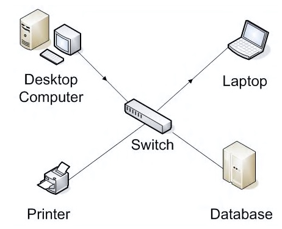

This lesson was based on the page [How does the Internet work?](https://developer.mozilla.org/en-US/docs/Learn/Common_questions/How_does_the_Internet_work) by MDN web docs

 

# How the Internet Works

The **Internet** is the backbone of the Web, the technical  infrastructure that makes the Web possible.

> At its most basic, the  Internet is a large **network of networks** of computers which communicate all together.

The simplest form of a network are two computers connected together with a single cable. 

 

 

Internet involves billions of computers so we know this model needs to be expanded.

We need a way for a group of connected computers (a smaller and local network) to communicate to another group of connected computers.

 

 

This arrangement is very similar to what is typically found in buildings such as John Abbott's Penfield, and lays some fundamentals to understanding how the internet works.

After all, the internet is a network of networks:

 

<a href="https://www.businessinsider.com/animated-map-global-fiber-optic-internet-cables-2015-9"><em>Internet fiber optic cables connecting North America and Europe</em></a>

 

## Networking Devices

Network devices connect nodes to a network and they connect different networks together.

Examples of networking devices are:

- Switch
- Router
- Wireless Access Point
- Modem

> It is the networking device that defines the physical media and speed of a network.

 

### NIC

The final piece of hardware that is required to allow a computer to be part of the network is the **network interface controller (NIC) also known as the network adapter**.

> This is the physical device that literally connects the computer to the physical media.

In the case of the LAN it would connect the computer to a twisted pair cable (Ethernet cable) or Wifi signal.

<a href=""><em>Ethernet NIC with PCIe attachment</em></a>

 

<a href=""><em>Wireless NIC module typically found in laptops</em></a>

 

The **MAC address or physical address** is controlled by the NIC. This is typically an address assigned by the manufacturer of the NIC.

MAC stands for **Media Access Code** and has the following format (in hexadecimal values): **DC-4A-3E-4A-3B-3D**

 

A NIC is required for Ethernet or Wireless connections. For wireless its also called WNIC (W for wireless).

Nowadays it's typically part of the motherboard.

 

### Switch

Network switches work similarly to the Hub but are more intelligent. When a message is received the switch **transmits it only to the specific destination node**.

The switch uses the node's MAC address (a sort of “machine burned-in ID”) to keep a list of all connected devices.

<a href="http://cloudcomputingnet.com/computer-network-components/"><em>Switches transmit messages from one device to another</em></a>

 

Switches behave similarly to an old-school telephone operator. Someone would call in and ask to be connected to a specific phone number. Then the operator would make the connection happen.

 

<a href=""><em>Switches and Routers work like an old-school telephone operator</em></a>

 

### Routers

Network routers are used to connect different networks together. These networks might be in the same building (LAN) or across the internet.

Routers are conscious of neighboring networks and dynamically update their routing information. They can discover when a route to a network is down and find out if another route is accessible.

 

 

<a href="https://www.cisco.com/en/US/docs/internetworking/troubleshooting/guide/tr1909.html"><em>Sample routing table for connected routers.</em></a>

 

Routers use IP addresses to manage their routing, which are easily modifiable addresses.

You can think of a router like a switch that can see beyond the nodes that are immediately connected to it. Instead of looking at the node's physical address (MAC), it looks are the logically assigned addresses (IP).

 

### Modem

The signals transmitted from one computer to another inside a LAN are typically transmitted over wifi or twisted pair cable (also know as ethernet cable or cat5).

However, to travel long distances, these signals need to be converted to the format of the physical media that will transport them, such as optical fiber, coaxial cable, phone line or satellite signals.

 

 

This is similar to the signal received for cable TV. The TV signal typically comes via coaxial cable, gets converted and is sent to the TV via HDMI cable.

> In order to convert the signals from one format to another we use a modem.
>
> Modem stands for **Mo**dulator / **Dem**odulator

This is an encoding and decoding process between two systems. The logic resembles the conversions that happen to go from text to binary in the ASCII encoding system.

**The type of modem required depends on the physical media being used to transmit the signal over long distances.**

 

The physical media that connects a LAN to the internet depends on the connection services being purchased by the user.

We'll take a quick look at the following connection services:

- Dial-Up
- DSL
- Cable
- Satellite
- Fiber

 

## Recommended Video

 

<iframe width="560" height="315" src="https://www.youtube.com/embed/ZhEf7e4kopM" frameborder="0" allow="accelerometer; autoplay; clipboard-write; encrypted-media; gyroscope; picture-in-picture" allowfullscreen></iframe>

